# JourneyWorks PoC

## Project Overview

This repo is a proof of concept demonstrating how AI technologies can be used to analyse and help improve customer
journeys with a business, in this example, HSBC bank

Mock natural looking customer communications are generated using the Mistral LLM model making up the following data sources
+ telephony transcripts [DONE]
+ emails [TODO]
+ custome service database [TODO]
+ twitter (X) feed [TODO]

The datasources with mock customer commnunications data are then ingested, normalised, parameterised and stored in a vector
database, Weaviate.

A RAG agentic response pipeline using the Mistral LLM model is then used to answer queries by augmenting the query
with the mock customer communications data that is stored in the vector database.

```mermaid
flowchart TD
  %% JourneyWorks / HSBC POC - end-to-end overview

  A["JourneyWorks POC\nAI to analyse & improve customer journeys\n(example: HSBC)"]

  subgraph S1["1) Generate mock customer communications (Mistral LLM)"]
    M["Mistral LLM"]

    T["Telephony transcripts\n✅ DONE"]
    E["Emails\n🟡 TODO"]
    C["Customer service database records\n🟡 TODO"]
    X["Twitter / X feed\n🟡 TODO"]

    M --> T
    M --> E
    M --> C
    M --> X
  end

  subgraph S2["2) Ingest → normalise → parameterise"]
    I["Ingestion pipeline\n(load, validate, dedupe)"]
    N["Normalisation\n(clean, standardise fields)"]
    P["Parameterisation\n(metadata/tags: journey_type, sentiment,\noutcome, timestamps, channel)"]

    I --> N --> P
  end

  subgraph S3["3) Store for retrieval"]
    W["Weaviate Vector Database\n(vectors + metadata + raw text)"]
  end

  subgraph S4["4) RAG agentic response pipeline (Mistral LLM)"]
    Q["User / Analyst query"]
    EMB["Embed query"]
    RET["Retrieve top-K evidence\n(nearVector + filters)"]
    AUG["Augment prompt\n(question + evidence snippets)"]
    GEN["Mistral LLM\n(generate grounded answer)"]
    OUT["Answer + evidence references\n(exec-friendly insight)"]

    Q --> EMB --> RET --> AUG --> GEN --> OUT
  end

  %% Connections across stages
  A --> S1
  T --> I
  E --> I
  C --> I
  X --> I

  P --> W
  W --> RET

  %% Optional emphasis
  classDef done fill:#d7f5d7,stroke:#2f8f2f,color:#000;
  classDef todo fill:#fff3cd,stroke:#d39e00,color:#000;
  class T done;
  class E,C,X todo;
```



## Repo Setup

Create an account on https://huggingface.co/
Find and download mistral-7b-instruct-v0.2.Q5_K_M.gguf
save in the `/models` folder


```pip install -U weaviate-client sentence-transformers llama-cpp-python pyyaml``` 


### MacOs specifics

Running on a mac mini, means Apple M3 Silicon and using Metal API to use the GPU.
To get llama-cpp-python package to work, it was required to use Python 3.13 and reinstall the package
with environment variables set to switch on Metal support and to turn off CPU parallelisation.

```CMAKE_ARGS="-DGGML_METAL=ON -DGGML_OPENMP=OFF" pip install --no-cache-dir --force-reinstall llama-cpp-python```  

Homebrew was used to install docker desktop, which will be used to run the vector database called Weaviate
```brew install --cask docker``` 

Run the docker application
```bash
docker run -d -p 8080:8080 \
  -e QUERY_DEFAULTS_LIMIT=20 \
  -e AUTHENTICATION_ANONYMOUS_ACCESS_ENABLED="true" \
  semitechnologies/weaviate:latest
```

### Windows specifics

You will need to install Docker Desktop and run Weaviate as above. (Instructions on how to do this are TODO)


## Running the project

### Generating the telephony outline transcripts

```shell
python generate_transcripts.py
```


The input specification file, defines 20 events, classified by an event_type, for example:
```text
events:
  - event_id: E01
    event_name: Mobile Banking App Redesign
    event_type: Product_Update
    
  - event_id: E02
    event_name: Savings Account Linked to Base Rate
    event_type: Product_Launch  
```

journey_types, describe the types of journeys a customer may experience when communicating about an event. For example,

```text
journey_types:
  - id: JT_APP_LOGIN
    name: "App login / access issue"
    
  - id: JT_APP_NAV
    name: "App usability / feature discovery"
    
  - id: JT_PRODUCT_INFO
    name: "Product information / eligibility"
    
  - id: JT_PRICING_DISPUTE
    name: "Pricing / interest / fee dispute"
    
  - id: JT_OUTAGE
    name: "Outage status / reassurance"
```

Each event is then limited to the types of journeys that can be experienced together with a probability of each journey
being followed. For example, 
```text
  E01: { JT_APP_NAV: 0.55, JT_APP_LOGIN: 0.30, JT_GENERAL_FEEDBACK: 0.15 }
  E02: { JT_PRODUCT_INFO: 0.45, JT_PRICING_DISPUTE: 0.40, JT_ACCOUNT_OPEN: 0.15 }
  E03: { JT_OUTAGE: 0.45, JT_COMPENSATION: 0.40, JT_APP_LOGIN: 0.15 }
  E04: { JT_GENERAL_FEEDBACK: 0.70, JT_PRODUCT_INFO: 0.30 }
```

Scenarios guidance is then created per journey type, describing the length of the conversation, how it might start,
how the customer service agent may respond and ways the conversation could end. For example,

```text
scenario_library:
  JT_APP_LOGIN:
    - scenario_id: S_APP_LOGIN_1
      length: short
      opening:
        - "Hi, I can't log into the HSBC app — it keeps looping on the sign-in screen."
        - "Hello, my app login isn't working after the latest update."
        - "I’m locked out of the app and I need to make a payment today."
      agent_moves:
        - "Confirm identity and ask device/OS details."
        - "Suggest basic troubleshooting steps: restart app, update, reinstall."
        - "Offer alternative access (online banking) and reset guidance."
      closings:
        resolved:
          - "Okay, that worked — I'm back in now. Thanks."
        partial:
          - "It's better, but it still feels unstable. I’ll try again later."
        escalated:
          - "I’ll escalate this to our technical team and arrange a callback."
        unresolved:
          - "I still can't access it. This is really disruptive."
```

Finally, some high level generator parameters are defined, which include the number of transcripts per event, distributions
of:
+ call lengths, 
+ distributions 
+ sentinments
+ outcomes
+ customer agent tone
+ customer temperament 

### Converting the unatural mock telephony transcripts to more natural language

The mistral llm model is leveraged to convert the generated mock telephony transcripts into natural flowing telephonic
conversations. This process is quite slow and took about 12 hours to complete 2000 conversations.

```shell
naturalise_with_mistral.py
```


This script takes the Mock transcripts as input and augments a query with the original transcript together with rules and context
about the scenario, following this query template:
```text
You are rewriting a fabricated customer support CALL transcript to sound more realistic and natural.
Constraints:
- Keep the SAME number of turns and SAME speakers in the SAME order.
- Keep the meaning consistent with the original.
- Reflect the labels: sentiment={sentiment}, outcome={outcome}, journey_type={journey_type}.
- Use {uk_register}.
- Agent style: {agent_style}. Customer style: {customer_style}.
- Do NOT add any personal data (no real names, phone numbers, addresses, account numbers).
- Profanity: {profanity}.
- Do NOT add extra commentary, headings, or analysis.
- Output MUST be valid JSON ONLY matching this schema: {json.dumps(schema)}.
- If you cannot comply, output: {{"turns":[]}}.

Context about the scenario:
- Event: {event_name}
- Channel: {channel}

ORIGINAL TRANSCRIPT:
{original_text}

Now rewrite it. Remember: JSON only.
```

So, for example:
```yaml
- transcript_id: E01-T001
  event_id: E01
  event_name: Mobile Banking App Redesign
  channel: phone
  scenario_id: S_APP_NAV_1
  journey_type: JT_APP_NAV
  sentiment: negative
  outcome: escalated
  turns:
  - speaker: Customer
    text: I’m really angry about this — Since the new app layout, I can't find where
      to manage standing orders.
  - speaker: Agent
    text: Certainly — Capture feedback about UI and accessibility.
  - speaker: Customer
    text: I’ve had enough — Why wasn’t this clearer?
  - speaker: Agent
    text: I appreciate that — Offer to send a help link or in-app guidance.
  - speaker: Customer
    text: This is unacceptable — I’m not happy about this.
  - speaker: Agent
    text: I appreciate that — I’m escalating this now and you’ll receive an update
      as soon as possible.
  - speaker: Customer
    text: I’m escalating your feedback to the app team and logging the issue.
  style:
    agent_tone: formal
    customer_temperament: angry
    target_turns: 7
```

becomes

```yaml
- transcript_id: E01-T001
  event_id: E01
  event_name: Mobile Banking App Redesign
  channel: phone
  scenario_id: S_APP_NAV_1
  journey_type: JT_APP_NAV
  sentiment: negative
  outcome: escalated
  turns:
  - speaker: Customer
    text: I'm finding it quite frustrating, really. Since the new app design, I can't
      seem to locate where to manage my standing orders.
  - speaker: Agent
    text: I understand your concern, sir. I'll make sure to pass on your feedback
      about the user interface and accessibility.
  - speaker: Customer
    text: I'm getting quite annoyed, to be honest. Why wasn't this more obvious?
  - speaker: Agent
    text: I can relate to that, sir. I'd be happy to send you a helpful link or provide
      in-app guidance if that would assist?
  - speaker: Customer
    text: This is completely unacceptable. I'm not at all content with this.
  - speaker: Agent
    text: I understand your disappointment, sir. I'll ensure that this matter is escalated
      to the appropriate team and you'll be updated as soon as possible.
  - speaker: Customer
    text: I'll be escalating this issue to the app team and logging the feedback.
  style:
    agent_tone: formal
    customer_temperament: angry
    target_turns: 7
  naturalised:
    status: ok
```


## Proof of Concept run stages

At this point the mock data for the Proof of Concept has been generated. Now we focus on the actual design that we are
proving for the project.

### Ingest the telephony data into Weaviate, a vector database

```shell
ingest_transcripts_to_weaviate.py
```

1. Load transcripts
+ reads structured transcript data from data/transcripts.yaml (or a timestamped variant).
+ Each transcript represents a single customer interaction (e.g. a phone call).

2. Extract and normalise fields
+ Pulls out key attributes such as:
  - event name
  - journey type
  - sentiment
  - outcome
  - channel
  - timestamps and duration (if present)
+ Combines the conversation turns into a single searchable text field.

4. Generate embeddings
+ Uses a local embedding model to convert each transcript’s text into a numerical vector.
+ These vectors capture the semantic meaning of the interaction, not just keywords.

5. Create or validate the Weaviate collection
+ Ensures a Weaviate collection (e.g. JourneyWorksTranscript) exists with:
+ vector storage
+ typed metadata fields (strings, numbers, dates)
+ This allows both semantic search and structured filtering.

6. Store data in Weaviate
+ Writes each transcript as an object containing:
+ the embedding vector
+ raw transcript text
+ metadata (journey, outcome, sentiment, timestamps, etc.)
+ Existing objects can be replaced or updated during re-ingestion.

This is done so that after ingestion:
+ Customer interactions can be retrieved using semantic similarity, not just exact text matches.
+ Queries can be filtered by journey type, outcome, sentiment, or time.
+ data is ready to be used by the RAG (Retrieval-Augmented Generation) pipeline, where an LLM (Mistral) answers questions using real (mock) customer evidence.

In short, this script is the bridge between generated customer communications and AI-powered insight.

### 
## `index_transcripts.py`

This script indexes customer interaction transcripts into a **Weaviate vector database**, enabling **semantic search** and **Retrieval-Augmented Generation (RAG)**.

It converts structured transcript data into vector embeddings and stores them together with rich metadata, making customer journeys searchable by *meaning*, not just keywords.

---

### What it does

`index_transcripts.py` performs the following steps:

1. **Load transcripts**
   - Reads generated and/or naturalised transcripts from a YAML file.
   - Each transcript represents a single customer interaction (e.g. a phone call).

2. **Prepare searchable content**
   - Flattens the conversation turns (customer and agent dialogue) into a single text representation suitable for semantic search.

3. **Generate embeddings**
   - Uses an embedding model to convert transcript text into numerical vectors.
   - These vectors capture semantic intent, tone, and topic rather than exact wording.

4. **Define or validate the Weaviate schema**
   - Ensures the target Weaviate collection exists with:
     - vector indexing enabled
     - typed metadata fields such as journey type, outcome, sentiment, channel, and timestamps.

5. **Index transcripts**
   - Stores each transcript in Weaviate with:
     - its embedding vector
     - raw transcript text
     - associated metadata for filtering and analysis.

---

### Why this matters

After running `index_transcripts.py`:

- Customer interactions can be retrieved using **semantic similarity**.
- Queries can be filtered by journey, outcome, sentiment, channel, or time.
- The data is ready for use in the **RAG pipeline**, where an LLM (Mistral) answers questions grounded in customer evidence.
- Journey analytics and time-based visualisations become possible.

In short, this script turns generated customer transcripts into **searchable journey intelligence**.


## RAG answering with Mistral

```shell
rag_answer_with_mistral.py
```

This script implements the **Retrieval-Augmented Generation (RAG)** stage of the project.  
It answers natural-language questions about customer journeys by retrieving relevant customer interactions from Weaviate and using a local **Mistral LLM** to generate grounded, evidence-based responses.

---

### Purpose

`rag_answer_with_mistral.py` connects semantic search with large-language-model reasoning.  
Instead of answering questions from general knowledge, it ensures that every response is **augmented with retrieved customer communications**, making the output traceable and trustworthy.

---

### What it does

The script performs the following steps:

1. **Accept a user query**
   - Takes a natural-language question (e.g. *“Why are pricing disputes escalating?”*).

2. **Embed the query**
   - Converts the query into a vector using the same embedding model used during indexing.

3. **Retrieve relevant evidence**
   - Queries the Weaviate vector database using semantic similarity.
   - Optionally filters results by journey type, outcome, sentiment, channel, or time.
   - Retrieves the top-K most relevant customer interactions.

4. **Build a grounded prompt**
   - Combines the original question with retrieved evidence snippets.
   - Applies strict instructions so the LLM:
     - uses only the provided evidence
     - avoids inventing facts
     - cites evidence references in its response.

5. **Generate the answer**
   - Uses the Mistral LLM (via `llama.cpp`) to produce a concise, executive-friendly response.
   - Outputs both:
     - the generated answer
     - a list of evidence items used to support it.

---

### Why this matters

After running `rag_answer_with_mistral.py`:

- Answers are **grounded in real (mock) customer interactions**, not model hallucinations.
- Each insight can be traced back to specific evidence in the dataset.
- Executives and analysts can trust the results and drill into supporting conversations.
- The system demonstrates how AI can surface actionable insights from customer journeys.

In short, this script turns stored customer interactions into **explainable, evidence-backed insight**.

---

### Typical usage

```bash
python rag_answer_with_mistral.py \
  --q "What are customers disputing about mortgage rate increases, and why does it escalate?" \
  --k 5 \
  --require-naturalised-ok