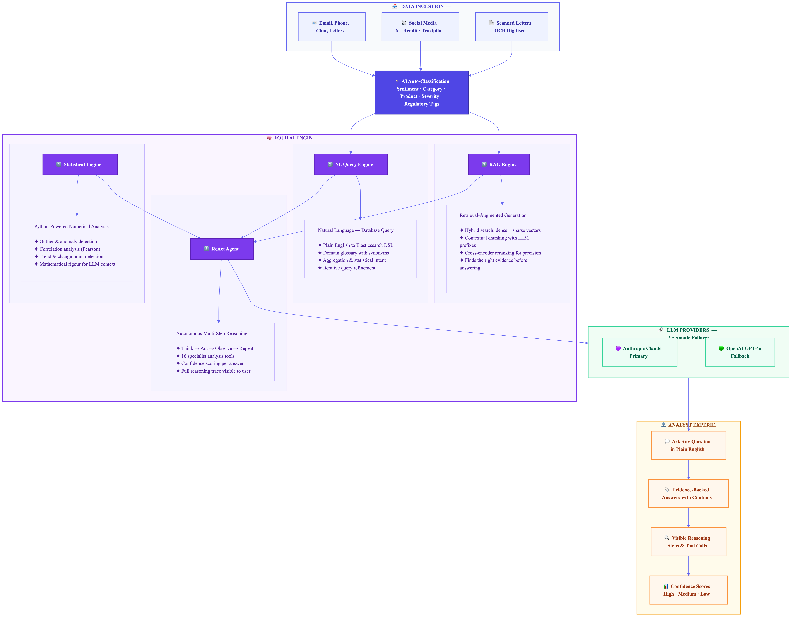

# JourneyWorks — AI Capabilities Proposal Slides

_Senior Management Presentation_

---

## Slide 1: The AI Advantage — From Reactive to Proactive Intelligence

### The Problem Today

| Manual Process                                                 | Impact                          |
| -------------------------------------------------------------- | ------------------------------- |
| Analysts **read thousands of complaints** individually         | Slow, inconsistent, expensive   |
| Categorisation is **manual and subjective**                    | Regulatory risk, audit failures |
| Insights emerge **weeks after trends start**                   | Missed early warnings           |
| Social media sentiment is **disconnected** from complaint data | Blind spots in reputation risk  |

### How JourneyWorks AI Transforms This

```
┌─────────────────────────────────────────────────────────────────────────────┐
│                                                                             │
│   Scales to 30,000+ communications / month                                  │
│   + Social media (X, Reddit, Trustpilot)                                    │
│   + Letters (OCR digitised) [ROADMAP]                                       │
│                                                                             │
│          ┌──────────────┐                                                   │
│          │   AI Engine   │                                                   │
│          └──────┬───────┘                                                   │
│                 │                                                            │
│    ┌────────────┼────────────┬─────────────────┐                            │
│    ▼            ▼            ▼                 ▼                            │
│ LLM-powered    Sentiment   Root Cause      Anomaly                         │
│ classification & Emotion   Analysis        Detection                       │
│ (regulatory,   tracking    (LLM-driven     (on-demand                      │
│  product,      across the  topic & theme   statistical                     │
│  severity)     journey     analysis)       outlier scanning)               │
│                                                                             │
│          ┌──────────────┐                                                   │
│          │   Analyst UI  │                                                   │
│          └──────────────┘                                                   │
│   • Ask questions in plain English                                          │
│   • Get evidence-backed answers in seconds                                  │
│   • Every insight cites its sources                                         │
│   • AI supports judgement — never replaces it                               │
│                                                                             │
└─────────────────────────────────────────────────────────────────────────────┘
```

### Key Outcomes

| Metric                                 | Before                | After                      |
| -------------------------------------- | --------------------- | -------------------------- |
| **Time to classify** a complaint       | 5–10 min (manual)     | **< 1 second** (AI) ¹      |
| **Time to identify** an emerging trend | Days / weeks          | **Minutes**                |
| **Classification consistency**         | Variable (human bias) | **Standardised** (LLM)     |
| **Regulatory alignment**               | Best-effort           | **FCA DISP auto-tagged** ¹ |

_¹ Production roadmap — architecture supports this; ingest-time classifier to be integrated._

> _"AI doesn't make decisions — it gives analysts superpowers."_

---

## Slide 2: Four AI Systems Working Together

### Architecture at a Glance



_High-resolution vector version also available: [ai-architecture-diagram.svg](./ai-architecture-diagram.svg)_

### What Makes This Best-in-Class

| Capability                                   | What It Means                                                                          | Why It Matters                                                                            |
| -------------------------------------------- | -------------------------------------------------------------------------------------- | ----------------------------------------------------------------------------------------- |
| **RAG Pipeline** (Hybrid Search + Reranking) | Dense vectors, sparse vectors, and cross-encoder reranking for precision retrieval     | Finds relevant evidence even when phrased differently — fewer irrelevant results          |
| **RRG** (Natural Language → Query)           | LLM translates plain English into structured Elasticsearch queries via domain glossary | Analysts search data conversationally — no query syntax needed                            |
| **ReAct Agent** with 19 specialist tools     | AI reasons step-by-step, calling tools for search, analysis, and correlation           | Can answer complex questions like _"Do outage complaints correlate with customer churn?"_ |
| **Statistical Analysis Service**             | Python-powered outlier detection, correlation, trend analysis, and anomaly detection   | Numerically precise insights — not just LLM guesswork                                     |
| **Computed Confidence Scoring**              | Evidence volume, source diversity, temporal coverage, and statistical significance     | Analysts know when to trust vs. verify — no meaningless "High Confidence" on everything   |
| **Full Reasoning Transparency**              | Every AI thought, action, tool call, and observation is shown to the analyst           | Trust & auditability — no "black box"                                                     |
| **Automatic LLM Fallback**                   | Primary: Anthropic Claude · Fallback: OpenAI GPT-4o                                    | Zero downtime if one provider has issues                                                  |

---

## Slide 3: Real-World Impact — AI-Powered Use Cases

### Use Cases Enabled by AI

```
 ┌──────────────────────────────────────────────────────────────────────────┐
 │                                                                          │
 │  ┌─────────────────────┐  ┌─────────────────────┐  ┌──────────────────┐ │
 │  │  🔍 COMPLAINTS      │  │  ⚠️ VULNERABILITY    │  │  📋 REGULATORY   │ │
 │  │     INTELLIGENCE     │  │     DETECTION        │  │     COMPLIANCE   │ │
 │  │                     │  │                     │  │                  │ │
 │  │ • Root cause across │  │ • Risk scoring per  │  │ • Regulatory     │ │
 │  │   thousands of cases│  │   customer          │  │   auto-tagging ¹ │ │
 │  │ • Theme clustering  │  │ • Sentiment         │  │ • SLA breach     │ │
 │  │ • Trend detection   │  │   analysis          │  │   detection      │ │
 │  │ • Category breakdown│  │ • At-risk customer  │  │ • Audit trail    │ │
 │  │                     │  │   identification    │  │   for every AI   │ │
 │  │                     │  │                     │  │   interaction ¹  │ │
 │  └─────────────────────┘  └─────────────────────┘  └──────────────────┘ │
 │                                                                          │
 │  ┌─────────────────────┐  ┌─────────────────────┐  ┌──────────────────┐ │
 │  │  📡 SOCIAL MEDIA     │  │  📊 OPERATIONAL      │  │  🤖 DEEP         │ │
 │  │     EARLY WARNING    │  │     ANALYTICS        │  │     RESEARCH     │ │
 │  │                     │  │                     │  │                  │ │
 │  │ • Cross-reference   │  │ • SLA compliance    │  │ • Multi-step     │ │
 │  │   social sentiment  │  │   monitoring        │  │   investigation  │ │
 │  │   with complaints   │  │ • Channel           │  │ • "Investigate   │ │
 │  │ • Reputation risk   │  │   escalation        │  │   if card outage │ │
 │  │   alerts            │  │   analysis          │  │   complaints     │ │
 │  │ • Social sentiment  │  │ • Resolution time   │  │   correlate with │ │
 │  │   as leading        │  │   statistics        │  │   churn"         │ │
 │  │   indicator for     │  │ • CDD remediation   │  │ • AI reasons     │ │
 │  │   complaint trends  │  │   tracking          │  │   autonomously   │ │
 │  └─────────────────────┘  └─────────────────────┘  └──────────────────┘ │
 │                                                                          │
 └──────────────────────────────────────────────────────────────────────────┘
```

### AI-Powered Analyst Experience

> **An analyst asks:** _"Why did mortgage complaints spike last Tuesday?"_

| Step | What the AI Does                                                                                                                                                                                          | Visible to Analyst  |
| ---- | --------------------------------------------------------------------------------------------------------------------------------------------------------------------------------------------------------- | ------------------- |
| 1    | **Thinks:** "I need to find mortgage complaints from last Tuesday and compare to normal volumes"                                                                                                          | ✅ Reasoning shown  |
| 2    | **Queries** Elasticsearch for mortgage complaints on that date                                                                                                                                            | ✅ Tool call shown  |
| 3    | **Analyses** sentiment distribution and root causes                                                                                                                                                       | ✅ Data shown       |
| 4    | **Searches** for related social media mentions                                                                                                                                                            | ✅ Evidence cited   |
| 5    | **Correlates** with known bank events (system outage logged that day)                                                                                                                                     | ✅ Sources linked   |
| 6    | **Answers:** _"72 mortgage complaints on Tuesday (3.5× normal). 89% cite online portal errors. This correlates with the 4-hour platform outage at 10:15am. Recommend: customer recovery communications."_ | ✅ Confidence: High |

### Governance & Trust

| Principle                    | Implementation                                                             |
| ---------------------------- | -------------------------------------------------------------------------- |
| **AI never decides**         | AI provides evidence and recommendations — analysts make decisions         |
| **Every answer has sources** | Citations link to specific communications and documents                    |
| **Confidence scoring**       | High / Medium / Low — analysts know when to trust vs. verify               |
| **Full audit trail**         | All LLM interactions logged · 7-year retention planned for production ¹    |
| **Data privacy**             | PII redaction before LLM calls ¹ · "Do Not Train" via enterprise agreement |

_¹ Production roadmap — architecture designed for these; implementation planned for production deployment._

---

_JourneyWorks: Turning thousands of monthly communications into actionable intelligence — in seconds, not weeks._
