# AI-Enhanced Customer Complaints Platform

## High-Level Architecture

```mermaid
flowchart TB
    subgraph External["External Systems"]
        direction LR
        CHANNELS[Customer Channels<br/>Email • Letters • Calls]
        SOCIAL[Social & News<br/>Twitter • Reddit • News APIs]
        EXISTING[Existing Systems<br/>QlikSense • Data Warehouse]
    end

    subgraph Platform["AI Complaints Intelligence Platform"]
        direction TB

        subgraph Ingest["Data Ingestion Tier"]
            GATEWAY[Ingestion Gateway<br/>OCR • ASR • Connectors]
            COMPLY[Compliance Layer<br/>PII Masking • Data Governance]
        end

        subgraph Core["Core AI Tier"]
            direction LR
            LLM[LLM Services<br/>Classification • Extraction<br/>Sentiment • Understanding]
            RAG[RAG Engine<br/>Vector Search • Retrieval<br/>Context Assembly]
            AGENT[Agentic Research<br/>Multi-step Analysis<br/>Report Generation]
        end

        subgraph Data["Data Tier"]
            direction LR
            VECTOR[(Vector<br/>Store)]
            STRUCTURED[(Structured<br/>Database)]
            CACHE[(Query<br/>Cache)]
        end

        subgraph Insight["Insight & Analytics Tier"]
            ANALYTICS[Analytics Engine<br/>Trends • Clusters • KPIs]
            NARRATIVE[Narrative Generation<br/>LLM Commentary • Data Cards]
        end
    end

    subgraph Users["Users & Interfaces"]
        direction LR
        DASH[📊 Dashboards]
        SEARCH[🔍 Research Interface]
        REPORTS[📄 Reports & Exports]
        API[🔌 API Access]
    end

    subgraph Gov["Governance & Security"]
        AUDIT[Audit & Logging]
        EXPLAIN[Explainability]
        ACCESS[Access Control]
    end

    %% Connections
    CHANNELS --> GATEWAY
    SOCIAL --> GATEWAY
    GATEWAY --> COMPLY
    COMPLY --> LLM
    COMPLY --> VECTOR

    LLM <--> RAG
    RAG <--> AGENT
    LLM --> STRUCTURED

    VECTOR <--> RAG
    STRUCTURED <--> ANALYTICS
    RAG --> CACHE

    ANALYTICS --> NARRATIVE
    NARRATIVE --> DASH
    AGENT --> REPORTS
    RAG --> SEARCH

    EXISTING <-.-> STRUCTURED
    EXISTING <-.-> DASH

    Gov -.-> Platform

    DASH --> Users
    SEARCH --> Users
    REPORTS --> Users
    API --> Users
```

---

## Layered Architecture View

---

## Context Diagram (C4 Style)

---

## Key Architecture Principles

| Principle                  | Implementation                                                         |
| -------------------------- | ---------------------------------------------------------------------- |
| **Separation of Concerns** | Distinct tiers for ingestion, AI processing, storage, and presentation |
| **Compliance by Design**   | PII masking at ingestion; audit trails throughout                      |
| **Scalability**            | Stateless AI services; scalable vector and structured storage          |
| **Explainability**         | All LLM outputs linked to source references                            |
| **Extensibility**          | Modular design allows adding new data sources and AI capabilities      |
| **Integration**            | APIs and connectors to existing bank systems (QlikSense, DW)           |

---

## Technology Stack (Suggested)

