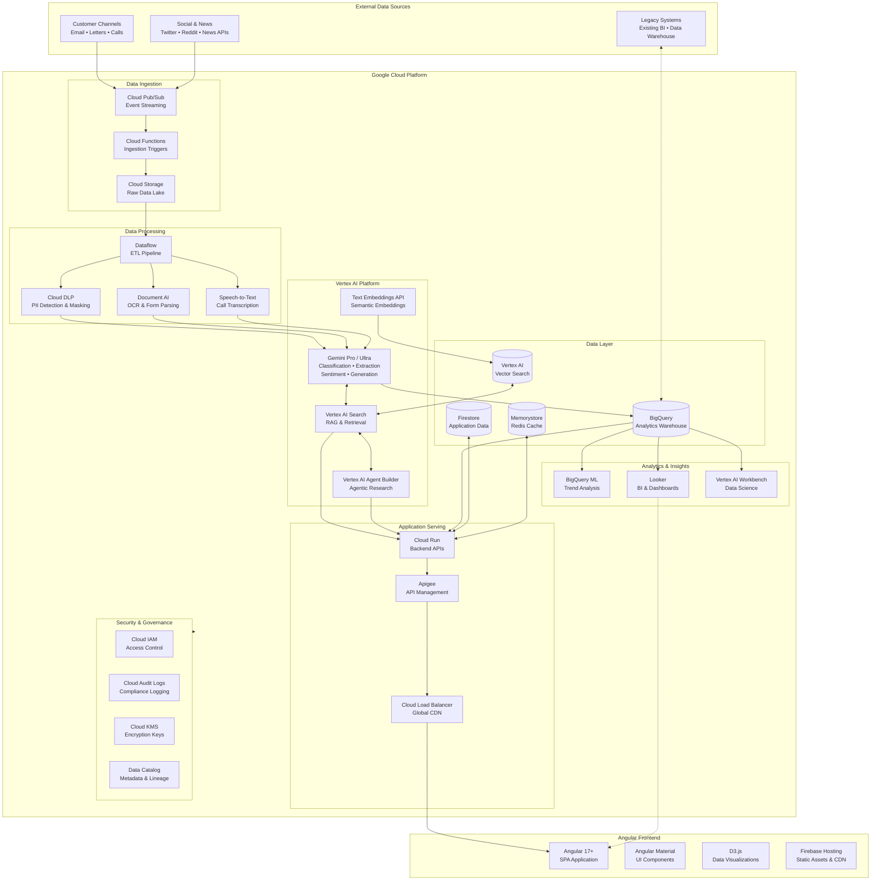
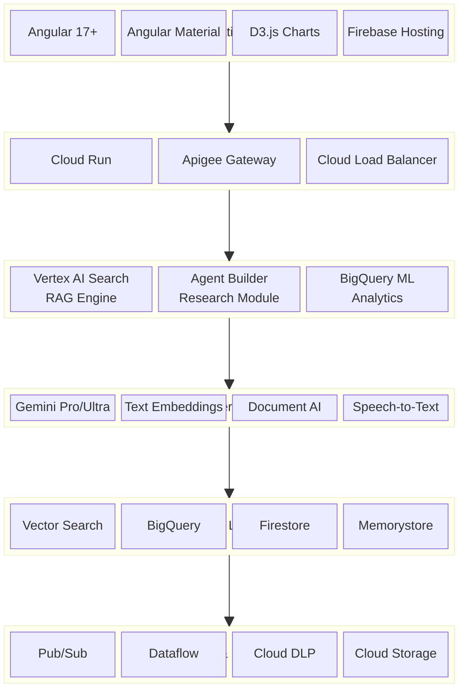
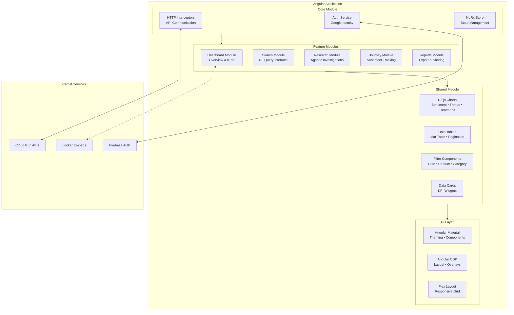
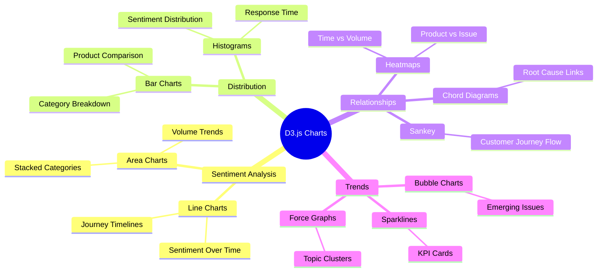
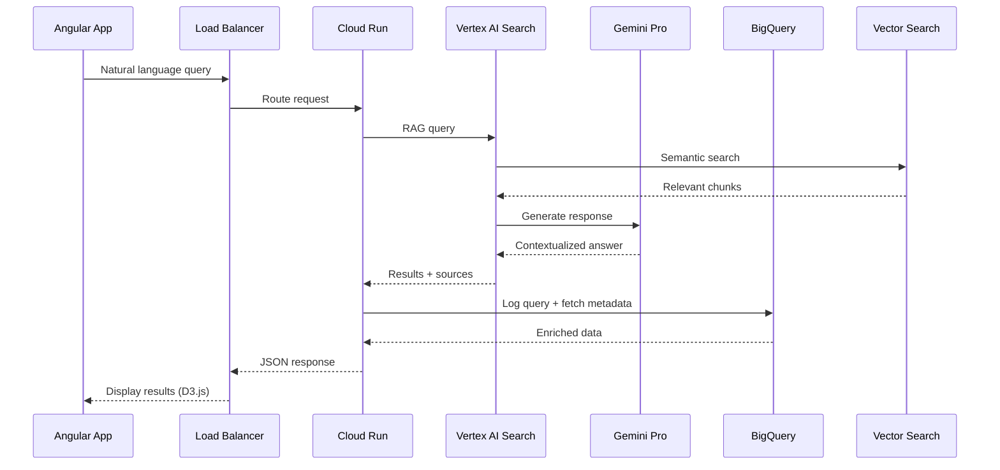
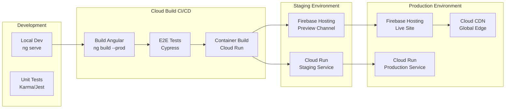
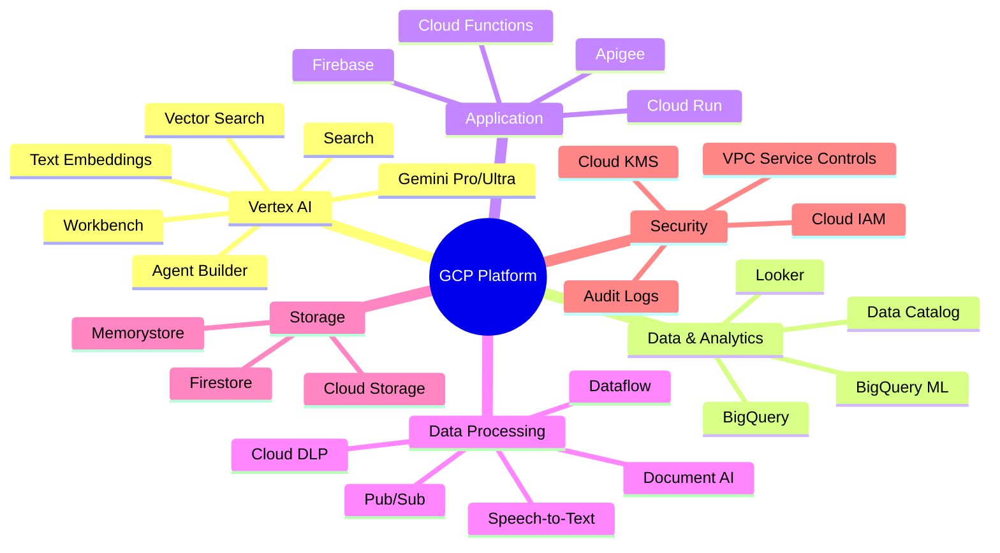

# AI-Enhanced Customer Complaints Platform

## GCP Architecture with Vertex AI

---

## Layered Architecture - GCP Stack

---

## Angular Frontend Architecture

---

## D3.js Visualization Components

---

## GCP Technology Stack

| Layer                | Technology              | Purpose                                       |
| -------------------- | ----------------------- | --------------------------------------------- |
| **Frontend**         | Angular 17+             | Single Page Application framework             |
|                      | Angular Material        | UI component library                          |
|                      | D3.js                   | Custom data visualizations                    |
|                      | Firebase Hosting        | Static asset hosting with CDN                 |
| **API Gateway**      | Apigee                  | API management, rate limiting, security       |
|                      | Cloud Load Balancer     | Global load balancing, SSL termination        |
| **Backend Services** | Cloud Run               | Serverless containerized APIs                 |
|                      | Cloud Functions         | Event-driven microservices                    |
| **AI/ML**            | Vertex AI Gemini        | LLM for classification, sentiment, generation |
|                      | Vertex AI Search        | RAG-based retrieval and Q&A                   |
|                      | Vertex AI Agent Builder | Agentic multi-step research                   |
|                      | Text Embeddings API     | Semantic vector embeddings                    |
|                      | Document AI             | OCR and document parsing                      |
|                      | Speech-to-Text          | Call transcription                            |
| **Data Storage**     | BigQuery                | Analytics data warehouse                      |
|                      | Vertex AI Vector Search | Vector similarity search                      |
|                      | Firestore               | Application state and metadata                |
|                      | Memorystore (Redis)     | Caching and session management                |
|                      | Cloud Storage           | Raw data lake (GCS buckets)                   |
| **Data Processing**  | Dataflow (Apache Beam)  | Streaming and batch ETL                       |
|                      | Cloud DLP               | PII detection and masking                     |
|                      | Pub/Sub                 | Event streaming and messaging                 |
| **Analytics**        | BigQuery ML             | In-database ML for trends                     |
|                      | Looker                  | BI dashboards and embedded analytics          |
|                      | Vertex AI Workbench     | Data science notebooks                        |
| **Security**         | Cloud IAM               | Identity and access management                |
|                      | Cloud KMS               | Encryption key management                     |
|                      | Cloud Audit Logs        | Compliance and audit trails                   |
|                      | Data Catalog            | Metadata management and lineage               |
| **DevOps**           | Cloud Build             | CI/CD pipelines                               |
|                      | Artifact Registry       | Container and package registry                |
|                      | Cloud Monitoring        | Observability and alerting                    |

---

## Data Flow Architecture

---

## Deployment Architecture

---

## Key GCP Services Summary

