# AI-Enhanced Customer Complaints Platform

## Hybrid Architecture Design

> **Approach:** Data processing and storage on-premises, cloud AI APIs for LLM inference, OCR, and speech-to-text.

---

## Architecture Overview

```mermaid
flowchart TB
    subgraph External["External Data Sources"]
        EMAIL[📧 Email Systems]
        LETTERS[📄 Document Scanning]
        CALLS[📞 Telephony/Call Recording]
        SOCIAL[📱 Social Media APIs]
        NEWS[📰 News Feeds]
    end

    subgraph OnPrem["On-Premises Infrastructure"]
        subgraph DMZ["DMZ / Edge"]
            NGINX[NGINX<br/>Reverse Proxy & WAF]
            CONNECTORS[API Connectors<br/>Social & News Ingestion]
        end

        subgraph Ingest["Ingestion Layer"]
            KAFKA[Apache Kafka<br/>Message Streaming]
            MINIO[MinIO<br/>Object Storage]
            AIRFLOW[Apache Airflow<br/>Workflow Orchestration]
        end

        subgraph Process["Processing Layer"]
            SPARK[Apache Spark<br/>ETL & Batch Processing]
            PRESIDIO[Microsoft Presidio<br/>PII Detection & Masking]
            QUEUE[Task Queue<br/>Celery / Redis Queue]
        end

        subgraph Data["Data Layer"]
            POSTGRES[(PostgreSQL<br/>+ pgvector)]
            ELASTIC[(Elasticsearch<br/>Full-Text Search)]
            REDIS[(Redis<br/>Cache & Sessions)]
            TIMESCALE[(TimescaleDB<br/>Time-Series Metrics)]
        end

        subgraph App["Application Layer"]
            FASTAPI[FastAPI<br/>Backend Services]
            LANGCHAIN[LangChain<br/>RAG Orchestration]
            AGENTS[LangGraph<br/>Agentic Workflows]
        end

        subgraph Analytics["Analytics Layer"]
            SUPERSET[Apache Superset<br/>Dashboards & BI]
            JUPYTER[JupyterHub<br/>Data Science]
            DBT[dbt<br/>Data Transforms]
        end

        subgraph Frontend["Presentation Layer"]
            ANGULAR[Angular 17+<br/>SPA Application]
            MATERIAL[Angular Material<br/>UI Components]
            D3[D3.js<br/>Visualizations]
        end
    end

    subgraph Cloud["Cloud AI Services (via API)"]
        subgraph GCP["Google Cloud"]
            GEMINI[Gemini Pro API<br/>Classification, Sentiment,<br/>Extraction, Generation]
            EMBED_GCP[Text Embeddings API]
            DOCAI[Document AI<br/>OCR & Form Parsing]
            STT_GCP[Speech-to-Text API]
        end

        subgraph Fallback["Fallback / Alternative"]
            OPENAI[OpenAI API<br/>GPT-4o]
            ANTHROPIC[Anthropic API<br/>Claude 3.5]
            AZURE_OAI[Azure OpenAI]
        end
    end

    subgraph Security["Security & Governance"]
        VAULT[HashiCorp Vault<br/>Secrets Management]
        KEYCLOAK[Keycloak<br/>Identity & SSO]
        AUDIT[Audit Logging<br/>Elasticsearch]
    end

    %% Data Flow
    EMAIL --> KAFKA
    LETTERS --> MINIO
    CALLS --> MINIO
    SOCIAL --> CONNECTORS
    NEWS --> CONNECTORS
    CONNECTORS --> KAFKA

    KAFKA --> AIRFLOW
    MINIO --> AIRFLOW
    AIRFLOW --> SPARK
    SPARK --> PRESIDIO

    PRESIDIO -->|PII-Masked Data| QUEUE
    QUEUE -->|OCR Request| DOCAI
    QUEUE -->|Transcription| STT_GCP
    QUEUE -->|Classification| GEMINI
    QUEUE -->|Embeddings| EMBED_GCP

    DOCAI -->|Text| QUEUE
    STT_GCP -->|Transcript| QUEUE
    GEMINI -->|Results| QUEUE
    EMBED_GCP -->|Vectors| QUEUE

    QUEUE --> POSTGRES
    QUEUE --> ELASTIC

    POSTGRES --> LANGCHAIN
    ELASTIC --> LANGCHAIN
    REDIS --> LANGCHAIN
    LANGCHAIN --> AGENTS
    LANGCHAIN <-->|LLM Calls| GEMINI

    LANGCHAIN --> FASTAPI
    AGENTS --> FASTAPI
    FASTAPI --> ANGULAR

    POSTGRES --> DBT
    DBT --> SUPERSET
    TIMESCALE --> SUPERSET

    Security -.-> OnPrem
    VAULT -.-> QUEUE
    KEYCLOAK -.-> ANGULAR
```



---

## Layered Architecture View


---

## Component Architecture

### Ingestion Components


### Processing Pipeline


### RAG Query Flow


### Agentic Research Flow

```mermaid
flowchart TB
    subgraph Input["Research Request"]
        QUERY[Complex Query<br/>"Investigate drivers behind<br/>negative mobile app sentiment"]
    end

    subgraph Planner["LangGraph Planner"]
        DECOMPOSE[Decompose into<br/>Sub-questions]
        PLAN[Create Execution Plan]
    end

    subgraph Executor["Task Executor"]
        SEARCH[Search Internal Data<br/>RAG Queries]
        ANALYZE[Statistical Analysis<br/>Pandas/NumPy]
        EXTERNAL[Fetch External Context<br/>Social/News APIs]
        SYNTHESIZE[Synthesize Findings]
    end

    subgraph LLM["Gemini Pro API"]
        REASON[Reasoning & Analysis]
        GENERATE[Report Generation]
    end

    subgraph Output["Research Output"]
        REPORT[Structured Report<br/>Summary, Evidence,<br/>Recommendations]
    end

    QUERY --> DECOMPOSE
    DECOMPOSE --> PLAN
    PLAN --> SEARCH
    PLAN --> ANALYZE
    PLAN --> EXTERNAL

    SEARCH <--> REASON
    ANALYZE <--> REASON
    EXTERNAL <--> REASON

    REASON --> SYNTHESIZE
    SYNTHESIZE --> GENERATE
    GENERATE --> REPORT
```

---

## Data Architecture

### Database Schema (PostgreSQL)


### Data Flow & Storage


---

## Security Architecture


### PII Masking Flow

```mermaid
flowchart LR
    subgraph Input["Raw Data"]
        RAW[Original Text<br/>"John Smith called about<br/>his account 12345678"]
    end

    subgraph Presidio["Presidio PII Detection"]
        DETECT[Detect Entities]
        NAME[NAME: John Smith]
        ACCOUNT[ACCOUNT: 12345678]
    end

    subgraph Mask["Masking"]
        REPLACE[Replace with Tokens]
        MASKED[Masked Text<br/>"[PERSON_1] called about<br/>his account [ACCOUNT_1]"]
    end

    subgraph Vault["Secure Vault"]
        STORE[Store Mapping<br/>PERSON_1 → John Smith<br/>ACCOUNT_1 → 12345678]
    end

    subgraph CloudCall["Cloud API Call"]
        SAFE[Safe to Send<br/>No Real PII]
    end

    RAW --> DETECT
    DETECT --> NAME
    DETECT --> ACCOUNT
    NAME --> REPLACE
    ACCOUNT --> REPLACE
    REPLACE --> MASKED
    REPLACE --> STORE
    MASKED --> SAFE
```

---

## Angular Frontend Architecture


### D3.js Visualization Components


---

## Deployment Architecture


---

## Technology Stack Summary

| Layer               | Technology            | Purpose                          | License           |
| ------------------- | --------------------- | -------------------------------- | ----------------- |
| **Frontend**        | Angular 17+           | SPA Framework                    | MIT               |
|                     | Angular Material      | UI Components                    | MIT               |
|                     | D3.js                 | Data Visualization               | ISC               |
|                     | NgRx                  | State Management                 | MIT               |
| **API Gateway**     | NGINX                 | Reverse Proxy, Load Balancer     | BSD               |
| **Backend**         | FastAPI               | REST API Framework               | MIT               |
|                     | Celery                | Task Queue                       | BSD               |
|                     | LangChain             | RAG Orchestration                | MIT               |
|                     | LangGraph             | Agentic Workflows                | MIT               |
| **Cloud AI**        | Gemini Pro            | LLM (Classification, Generation) | Commercial API    |
|                     | Text Embeddings API   | Vector Embeddings                | Commercial API    |
|                     | Document AI           | OCR                              | Commercial API    |
|                     | Speech-to-Text        | Transcription                    | Commercial API    |
| **Data Processing** | Apache Spark          | ETL, Batch Processing            | Apache 2.0        |
|                     | Apache Kafka          | Message Streaming                | Apache 2.0        |
|                     | Apache Airflow        | Workflow Orchestration           | Apache 2.0        |
|                     | Microsoft Presidio    | PII Detection                    | MIT               |
| **Databases**       | PostgreSQL + pgvector | Relational + Vector              | PostgreSQL        |
|                     | Elasticsearch         | Search & Logging                 | SSPL / Apache 2.0 |
|                     | Redis                 | Caching                          | BSD               |
|                     | TimescaleDB           | Time-Series                      | Apache 2.0        |
| **Object Storage**  | MinIO                 | S3-Compatible Storage            | AGPL              |
| **Analytics**       | Apache Superset       | Dashboards & BI                  | Apache 2.0        |
|                     | dbt                   | Data Transforms                  | Apache 2.0        |
|                     | JupyterHub            | Data Science                     | BSD               |
| **Security**        | Keycloak              | Identity & SSO                   | Apache 2.0        |
|                     | HashiCorp Vault       | Secrets Management               | MPL 2.0           |
| **Infrastructure**  | Kubernetes            | Container Orchestration          | Apache 2.0        |
|                     | Docker                | Containerization                 | Apache 2.0        |
|                     | Prometheus + Grafana  | Monitoring                       | Apache 2.0        |

---

## Network Architecture


---

## Monitoring & Observability


---

## Key Design Decisions

| Decision                     | Rationale                                                     |
| ---------------------------- | ------------------------------------------------------------- |
| **On-prem data storage**     | Regulatory compliance, data sovereignty, reduced egress costs |
| **Cloud AI APIs only**       | No GPU investment, always latest models, pay-per-use          |
| **PII masking before cloud** | Compliance with data protection, reduces risk                 |
| **PostgreSQL + pgvector**    | Single database for relational + vector, simpler ops          |
| **LangChain + LangGraph**    | Proven RAG framework, good agent support                      |
| **Kubernetes deployment**    | Scalability, standardized ops, self-healing                   |
| **Apache Kafka**             | Reliable event streaming, decoupled architecture              |
| **Keycloak for auth**        | Enterprise SSO, OIDC/SAML, free                               |

---

_Architecture Version: 1.0_  
_Last Updated: December 2024_
