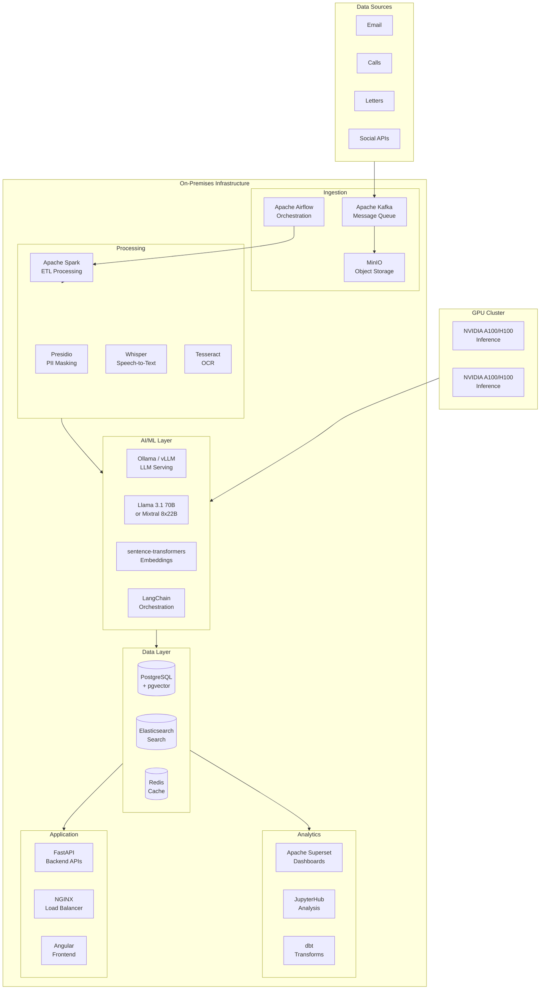
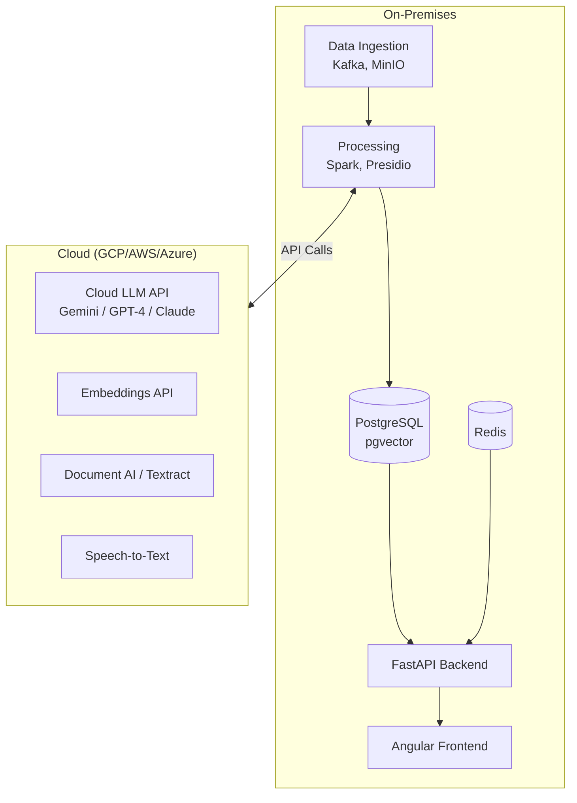
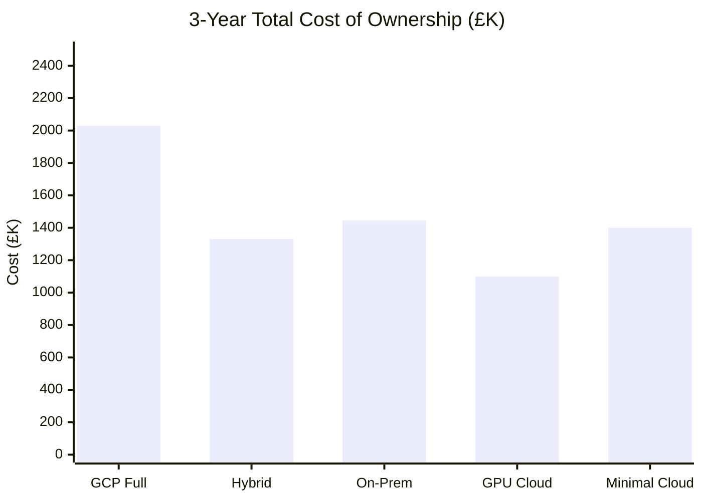
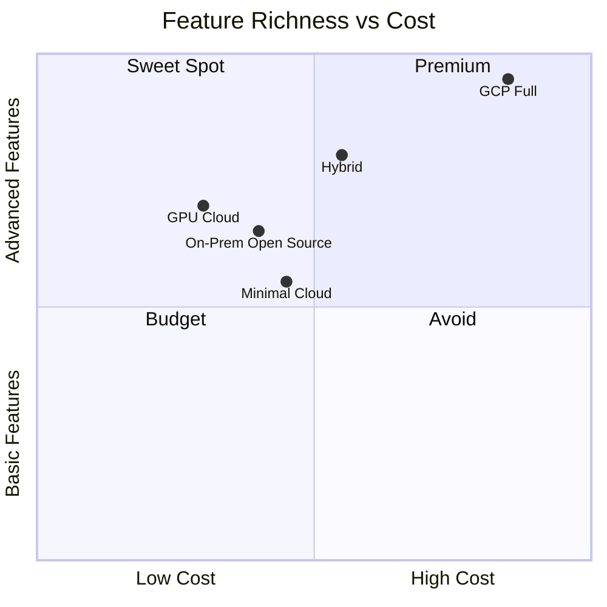

# AI-Enhanced Customer Complaints Platform

## Alternative Implementation Options & Cost Comparison

This document explores lower-cost alternatives to the full GCP/Vertex AI implementation, including on-premises, hybrid, and open-source approaches.

---

## Executive Comparison

| Option                          | Year 1 Cost   | Year 2+ Cost  | Pros                                    | Cons                                    |
| ------------------------------- | ------------- | ------------- | --------------------------------------- | --------------------------------------- |
| **GCP Full (Baseline)**         | £800K - £1.2M | £375K - £530K | Fastest, fully managed, cutting-edge AI | Highest cost, vendor lock-in            |
| **Hybrid (On-Prem + Cloud AI)** | £600K - £900K | £250K - £380K | Balance of control & capability         | Complexity                              |
| **On-Prem Open Source**         | £500K - £750K | £180K - £280K | Lowest running cost, full control       | Slower, more dev effort, GPU investment |
| **AWS Alternative**             | £750K - £1.1M | £320K - £480K | Mature ecosystem, Bedrock               | Similar to GCP                          |
| **Azure Alternative**           | £700K - £1M   | £300K - £450K | Enterprise integration, OpenAI          | Good if Microsoft shop                  |

---

## Option 1: On-Premises Open Source Stack

### Architecture Overview

### Technology Stack

| Layer              | Open Source Technology                 | Replaces (GCP)          |
| ------------------ | -------------------------------------- | ----------------------- |
| **LLM**            | Llama 3.1 70B, Mixtral 8x22B, Qwen 2.5 | Gemini Pro              |
| **LLM Serving**    | vLLM, Ollama, TGI                      | Vertex AI Endpoints     |
| **Embeddings**     | sentence-transformers, BGE             | Text Embeddings API     |
| **Vector Store**   | pgvector, Milvus, Qdrant               | Vertex AI Vector Search |
| **RAG Framework**  | LangChain, LlamaIndex                  | Vertex AI Search        |
| **Agents**         | LangGraph, CrewAI, AutoGen             | Agent Builder           |
| **OCR**            | Tesseract, PaddleOCR                   | Document AI             |
| **Speech-to-Text** | Whisper (OpenAI open-source)           | Cloud Speech-to-Text    |
| **PII Masking**    | Microsoft Presidio                     | Cloud DLP               |
| **Data Pipeline**  | Apache Kafka, Spark, Airflow           | Pub/Sub, Dataflow       |
| **Database**       | PostgreSQL + pgvector                  | BigQuery, Firestore     |
| **Search**         | Elasticsearch / OpenSearch             | BigQuery Search         |
| **Cache**          | Redis                                  | Memorystore             |
| **Dashboards**     | Apache Superset, Grafana               | Looker                  |
| **Object Storage** | MinIO                                  | Cloud Storage           |

### Hardware Requirements

| Component               | Specification                  | Quantity | Est. Cost               |
| ----------------------- | ------------------------------ | -------- | ----------------------- |
| **GPU Servers**         | 4x NVIDIA A100 80GB or 2x H100 | 2        | £200,000 - £350,000     |
| **Application Servers** | 32 vCPU, 128GB RAM             | 4        | £40,000                 |
| **Database Servers**    | 64 vCPU, 512GB RAM, NVMe       | 2        | £50,000                 |
| **Storage (NAS/SAN)**   | 100TB usable                   | 1        | £60,000                 |
| **Networking**          | 25Gbps switches, firewalls     | 1        | £30,000                 |
| **Total Hardware**      |                                |          | **£380,000 - £530,000** |

> **Note:** GPU costs are the major factor. Consider leasing or GPU-as-a-Service for lower CapEx.

### On-Prem Cost Breakdown

#### Year 1 (Build + Infrastructure)

| Category                  | Cost                      |
| ------------------------- | ------------------------- |
| **Hardware (CapEx)**      | £380,000 - £530,000       |
| **Development**           | £350,000 - £500,000       |
| **Data Centre / Hosting** | £40,000 - £60,000         |
| **Licenses (if any)**     | £10,000 - £20,000         |
| **Total Year 1**          | **£780,000 - £1,110,000** |

#### Year 2+ (Operations)

| Category                    | Annual Cost             |
| --------------------------- | ----------------------- |
| **Data Centre / Power**     | £40,000 - £60,000       |
| **Hardware Maintenance**    | £30,000 - £50,000       |
| **Operations Team (2 FTE)** | £120,000 - £160,000     |
| **Software Updates**        | £15,000 - £25,000       |
| **Total Annual**            | **£205,000 - £295,000** |

#### 3-Year TCO

| Year             | Cost                        |
| ---------------- | --------------------------- |
| Year 1           | £780,000 - £1,110,000       |
| Year 2           | £205,000 - £295,000         |
| Year 3           | £205,000 - £295,000         |
| **3-Year Total** | **£1,190,000 - £1,700,000** |

> **Comparison:** GCP 3-year TCO was £1,565,000 - £2,510,000. On-prem can save **20-35%** over 3 years.

---

## Option 2: Hybrid Approach (Recommended for Cost/Capability Balance)

### Architecture

### Concept

- **On-Prem:** Data storage, processing, application serving, vector database
- **Cloud:** LLM inference, embeddings, OCR, speech-to-text (pay-per-use)

This keeps sensitive data on-prem while using cloud AI APIs only for processing (with PII masked).

### Hybrid Cost Breakdown

#### Year 1

| Category                     | Cost                    |
| ---------------------------- | ----------------------- |
| **Hardware (No GPU needed)** | £120,000 - £180,000     |
| **Development**              | £400,000 - £550,000     |
| **Cloud AI APIs**            | £60,000 - £100,000      |
| **Data Centre**              | £30,000 - £50,000       |
| **Total Year 1**             | **£610,000 - £880,000** |

#### Year 2+

| Category                  | Annual Cost             |
| ------------------------- | ----------------------- |
| **Cloud AI APIs**         | £80,000 - £140,000      |
| **Data Centre / Hosting** | £30,000 - £50,000       |
| **Operations (1.5 FTE)**  | £90,000 - £130,000      |
| **Maintenance**           | £20,000 - £35,000       |
| **Total Annual**          | **£220,000 - £355,000** |

#### 3-Year TCO

| Year             | Cost                        |
| ---------------- | --------------------------- |
| Year 1           | £610,000 - £880,000         |
| Year 2           | £220,000 - £355,000         |
| Year 3           | £230,000 - £370,000         |
| **3-Year Total** | **£1,060,000 - £1,605,000** |

> **Savings vs GCP Full:** 25-35% lower TCO with good capability balance.

---

## Option 3: Lightweight Cloud (Minimal GCP)

### Concept

Use only essential GCP services, self-manage more components:

| Use GCP For              | Self-Manage                              |
| ------------------------ | ---------------------------------------- |
| Gemini API (pay-per-use) | Cloud Run → GKE (cheaper at scale)       |
| Cloud Storage            | BigQuery → PostgreSQL                    |
| Basic Pub/Sub            | Vertex AI Search → pgvector + custom RAG |

### Cost Reduction

| Service           | GCP Full     | Minimal GCP   | Savings                    |
| ----------------- | ------------ | ------------- | -------------------------- |
| Vertex AI Search  | £2,400/year  | £0 (pgvector) | 100%                       |
| BigQuery          | £15,000/year | PostgreSQL    | 80%                        |
| Looker            | £30,000/year | Superset      | 100%                       |
| Agent Builder     | £7,200/year  | LangGraph     | 100%                       |
| **Total Savings** |              |               | **£40,000 - £60,000/year** |

---

## Option 4: Self-Hosted GPU Cloud (Lambda Labs, CoreWeave, RunPod)

### Concept

Instead of buying GPUs, rent dedicated GPU instances from GPU cloud providers at lower cost than hyperscalers.

### Pricing Comparison (per GPU-hour)

| Provider        | A100 80GB     | H100          |
| --------------- | ------------- | ------------- |
| **GCP**         | £2.50 - £3.50 | £4.00 - £5.00 |
| **AWS**         | £2.80 - £3.80 | £4.50 - £5.50 |
| **Lambda Labs** | £1.20 - £1.50 | £2.00 - £2.50 |
| **CoreWeave**   | £1.50 - £2.00 | £2.50 - £3.00 |
| **RunPod**      | £1.00 - £1.30 | £1.80 - £2.20 |

### Cost Estimate (GPU Cloud + Self-Managed)

| Category                    | Monthly         | Annual                |
| --------------------------- | --------------- | --------------------- |
| **GPU Instances (2x A100)** | £2,500 - £4,000 | £30,000 - £48,000     |
| **Compute (CPU VMs)**       | £500 - £1,000   | £6,000 - £12,000      |
| **Storage**                 | £200 - £400     | £2,400 - £4,800       |
| **Total Infrastructure**    |                 | **£38,400 - £64,800** |

> **Comparison:** GCP infrastructure was £170,000 - £285,000/year. GPU cloud can be **60-75% cheaper**.

---

## Option 5: Smaller LLM Strategy

### Concept

Use smaller, efficient models instead of 70B+ parameter models:

| Task           | Large Model  | Efficient Alternative | Quality Trade-off    |
| -------------- | ------------ | --------------------- | -------------------- |
| Classification | Gemini Pro   | Llama 3.1 8B, Phi-3   | Minimal (fine-tuned) |
| Sentiment      | Gemini Pro   | DistilBERT, Phi-3     | Negligible           |
| Extraction     | Gemini Pro   | Llama 3.1 8B          | Minimal              |
| Generation     | Gemini Pro   | Llama 3.1 70B         | Moderate             |
| Research       | Gemini Ultra | Llama 3.1 70B + RAG   | Moderate             |

### Hardware Requirements (Smaller Models)

| Model                     | GPU Required       | Cost                 |
| ------------------------- | ------------------ | -------------------- |
| Llama 3.1 8B              | 1x RTX 4090 (24GB) | £1,800               |
| Llama 3.1 70B (quantized) | 2x RTX 4090        | £3,600               |
| Mixtral 8x7B              | 2x RTX 4090        | £3,600               |
| **Total**                 |                    | **£5,000 - £10,000** |

> **Note:** Consumer GPUs can run quantized models effectively for moderate throughput.

---

## Comparison Summary

### 3-Year TCO Comparison

### Feature vs Cost Trade-off

### Decision Matrix

| Factor                     | GCP Full   | Hybrid   | On-Prem    | GPU Cloud  |
| -------------------------- | ---------- | -------- | ---------- | ---------- |
| **3-Year Cost**            | ⭐⭐       | ⭐⭐⭐⭐ | ⭐⭐⭐     | ⭐⭐⭐⭐⭐ |
| **Time to Value**          | ⭐⭐⭐⭐⭐ | ⭐⭐⭐⭐ | ⭐⭐       | ⭐⭐⭐     |
| **AI Capability**          | ⭐⭐⭐⭐⭐ | ⭐⭐⭐⭐ | ⭐⭐⭐     | ⭐⭐⭐⭐   |
| **Data Control**           | ⭐⭐       | ⭐⭐⭐⭐ | ⭐⭐⭐⭐⭐ | ⭐⭐⭐     |
| **Operational Simplicity** | ⭐⭐⭐⭐⭐ | ⭐⭐⭐   | ⭐⭐       | ⭐⭐⭐     |
| **Scalability**            | ⭐⭐⭐⭐⭐ | ⭐⭐⭐⭐ | ⭐⭐⭐     | ⭐⭐⭐⭐   |
| **Vendor Lock-in**         | ⭐         | ⭐⭐⭐   | ⭐⭐⭐⭐⭐ | ⭐⭐⭐⭐   |

---

## Recommendations

### For Maximum Cost Savings

**→ GPU Cloud (Lambda/CoreWeave) + Open Source Stack**

- 3-Year TCO: ~£1.1M (55% of GCP)
- Trade-off: More DevOps effort, slightly less cutting-edge AI

### For Best Balance (Recommended)

**→ Hybrid Approach**

- 3-Year TCO: ~£1.3M (65% of GCP)
- Keep data on-prem, use cloud AI APIs
- Good capability, manageable complexity

### For Regulated/Data-Sensitive Environments

**→ Full On-Premises**

- 3-Year TCO: ~£1.4M (70% of GCP)
- Complete data sovereignty
- Requires strong in-house ML/DevOps capability

### For Fastest Delivery & Lowest Risk

**→ GCP Full (with optimizations)**

- 3-Year TCO: ~£1.8M (with discounts)
- Fastest time to value
- Best for teams without deep ML expertise

---

## Next Steps

1. **Assess Data Sensitivity** - Can PII-masked data go to cloud APIs?
2. **Evaluate In-House Skills** - Do you have ML/DevOps expertise for on-prem?
3. **Run Pilot Comparison** - Test open-source LLMs vs Gemini on your data
4. **Calculate True TCO** - Include team training, recruitment, opportunity cost

---

_Estimates prepared: December 2024_
