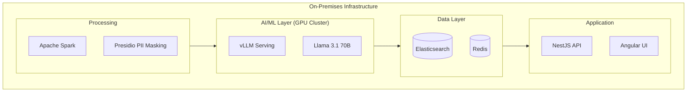
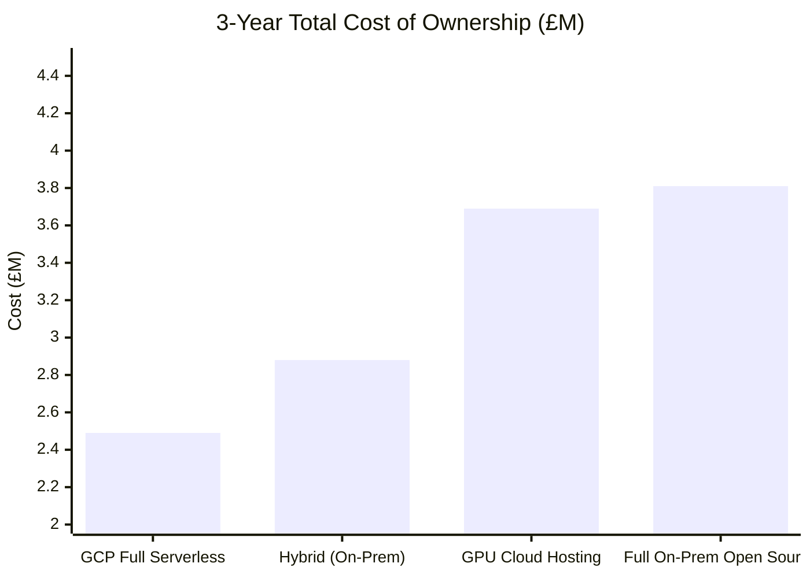

# Solution Design Document: Cost Comparison & Alternatives

## Executive Comparison

This document explores alternative implementation models for the JourneyWorks platform, comparing the primary GCP Architecture (`ssd-gcp.md`) against a Hybrid On-Premises model (`ssd-on-prem.md`), a fully open-source hardware approach, and GPU Cloud alternatives.

_Note: All 3-Year TCOs include comprehensive Team OpEx (estimated at £702,000/year), Hardware/Infrastructure, Licensing, and External Data APIs across all environments (Production, UAT, and SIT)._

| Option                             | Year 1 Cost  | Year 2+ Cost | 3-Year TCO  | Pros                                           | Cons                               |
| :--------------------------------- | :----------- | :----------- | :---------- | :--------------------------------------------- | :--------------------------------- |
| **GCP Full Serverless (Baseline)** | **£831,600** | **£831,600** | **£2.49M**  | Lowest TCO, pay-per-use, zero hardware ops     | Cloud vendor dependency            |
| **Hybrid (On-Prem + Vertex)**      | £1,123,860   | £879,060     | **£2.88M**  | Local data residency, avoids massive GPU CapEx | Higher 3-year TCO, K8s overhead    |
| **Full On-Prem Open Source**       | ~£2,033,800  | ~£889,000    | **~£3.81M** | 100% data sovereignty, zero API egress         | Massive GPU CapEx, highly complex  |
| **GPU Cloud + Self-Managed**       | ~£1,173,000  | ~£1,173,000  | **~£3.52M** | Avoids CapEx, fixed GPU availability           | GPU rental limits scalability down |

> **Paradigm Shift:** In conventional projects, cloud can be more expensive. However, based on JourneyWorks' volume (~30,000 cases/mo translating to ~75M tokens/mo), the variable Serverless GCP model outcompetes fixed-cost On-Premise architectures. At this specific volume, buying physical infrastructure is significantly more expensive than simply invoking Vertex AI.

---

## Option 1: GCP Full Serverless (Baseline)

### Architecture Concept

Relies on managed services (GKE Autopilot, managed Elastic Cloud, Cloud Composer) and native Vertex AI for the LLM.

### Why it Wins on Cost

- **Autopilot:** We only pay for the exact vCPU/RAM requested by the active pods. If volume drops, costs drop.
- **AI API Efficiency:** 75 Million tokens through Gemini 1.5 costs only ~£400/month. This is drastically cheaper than running an LLM 24/7 on dedicated GPUs.

### 3-Year TCO Breakdown

| Category                    | Year 1       | Year 2       | Year 3       |
| :-------------------------- | :----------- | :----------- | :----------- |
| GCP Infra/APIs (Prod)       | £35,520      | £35,520      | £35,520      |
| GCP Infra/APIs (SIT + UAT)  | £34,080      | £34,080      | £34,080      |
| External Data APIs (Social) | £60,000      | £60,000      | £60,000      |
| Team & Management           | £702,000     | £702,000     | £702,000     |
| **Total**                   | **£831,600** | **£831,600** | **£831,600** |

**3-Year TCO: £2,494,800**

#### Year 1: Build & Deploy

| Category                    | Investment   |
| --------------------------- | ------------ |
| GCP Infra/APIs (Prod)       | £35,520      |
| GCP Infra/APIs (SIT + UAT)  | £34,080      |
| External Data APIs (Social) | £60,000      |
| Team & Management           | £702,000     |
| **Total Year 1**            | **£831,600** |

#### Year 2+: Operate & Enhance

| Category                    | Annual Cost  |
| --------------------------- | ------------ |
| GCP Infra/APIs (Prod)       | £35,520      |
| GCP Infra/APIs (SIT + UAT)  | £34,080      |
| External Data APIs (Social) | £60,000      |
| Team & Management           | £702,000     |
| **Total Annual**            | **£831,600** |

---

## Option 2: Hybrid Approach (Recommended DB Alternative)

### Architecture Concept

The application orchestrator, Vector DB (Elasticsearch), and data pipelines run on bare-metal Kubernetes servers within an on-premises datacenter. AI calls are made securely across the internet/VPN to Vertex AI via PII-redacted gateways.

### Hardware Details

- 3x Control Plane + 5x Worker Nodes + 3x Elastic Nodes + 3x Redis per Production Datacenter.
- Duplicated entirely for DR.
- Separate physical clusters required for UAT and SIT.

### 3-Year TCO Breakdown

| Category                            | Year 1         | Year 2       | Year 3       |
| :---------------------------------- | :------------- | :----------- | :----------- |
| Hardware CapEx (Prod, DR, UAT, SIT) | £244,800       | £0           | £0           |
| Licensing & Vertex API OpEx         | £157,560       | £157,560     | £157,560     |
| DC Power / Environmentals           | £19,500        | £19,500      | £19,500      |
| Team & Management                   | £702,000       | £702,000     | £702,000     |
| **Total**                           | **£1,123,860** | **£879,060** | **£879,060** |

**3-Year TCO: £2,881,980**  
_(+£387K vs GCP Serverless)_

#### Year 1: Build & Deploy

| Category                            | Investment     |
| ----------------------------------- | -------------- |
| Hardware CapEx (Prod, DR, UAT, SIT) | £244,800       |
| Licensing & Vertex API OpEx         | £157,560       |
| DC Power / Environmentals           | £19,500        |
| Team & Management                   | £702,000       |
| **Total Year 1**                    | **£1,123,860** |

#### Year 2+: Operate & Enhance

| Category                    | Annual Cost  |
| --------------------------- | ------------ |
| Hardware CapEx              | £0           |
| Licensing & Vertex API OpEx | £157,560     |
| DC Power / Environmentals   | £19,500      |
| Team & Management           | £702,000     |
| **Total Annual**            | **£879,060** |

---

## Option 3: On-Premises Open Source Stack

### Concept

Total removal from cloud vendors. Deploying Open Source LLMs (like Llama 3.1 70B or Mixtral 8x22B) on internal infrastructure using tools like vLLM.

### Hardware Reality Check

To run a 70B parameter model at acceptable throughput for 50 concurrent analysts requires substantial GPU power.

- **GPU Inference Server (e.g., 4x NVIDIA A100 80GB):** ~£150,000 each.
- **Cluster Sizing:** 2 servers for Prod HA, 2 for DR, 1 for UAT, 1 for SIT = 6 Servers = **£900,000 CapEx**.
- **The Savings?** You save the monthly Vertex AI fee (£400 Prod + £400 UAT + £80 SIT = ~£10,500 / year).
- Spending £900,000 to save £10,500/year results in a functionally negative ROI.

### Architecture Overview

```mermaid
flowchart TB
    subgraph OnPrem["On-Premises Infrastructure"]
        subgraph Process["Processing"]
            SPARK[Apache Spark]
            PRESIDIO[Presidio PII Masking]
        end

        subgraph AI["AI/ML Layer (GPU Cluster)"]
            OLLAMA[vLLM Serving]
            LLAMA[Llama 3.1 70B]
        end

        subgraph Data["Data Layer"]
            ELASTIC[(Elasticsearch)]
            REDIS[(Redis)]
        end

        subgraph Serve["Application"]
            API[NestJS API]
            ANGULAR[Angular UI]
        end
    end

    Process --> AI
    AI --> Data
    Data --> Serve
```

### 3-Year TCO Estimate

_(Assuming Hybrid baseline + GPU CapEx, minus Vertex AI costs)_

- **Year 1:** £1,123,860 (Hybrid) + £900,000 (GPUs) + £20,500 (Extra Power) - £10,560 (No Vertex) = **£2,033,800**
- **Year 2+:** £879,060 (Hybrid) + £20,500 (Extra Power) - £10,560 (No Vertex) = **£889,000**
- **3-Year TCO: ~£3.81M**

---

## Option 4: Self-Hosted GPU Cloud (Lambda Labs / CoreWeave)

### Concept

Run the Open Source stack, but rent GPUs from specialist AI cloud providers instead of buying them.

- A100 80GB costs ~£1.50 - £2.00 / hour.
- Running 4x A100s across environments 24/7 = **~£5,000 - £7,000 / month per environment**.

### 3-Year TCO Estimate

- **GPU Servers (Prod, UAT, SIT):** ~£15,000/month = £180,000/year.
- **Other Infra (Bare Metal K8s Cloud):** ~£12,000/month = £144,000/year.
- **Licenses & Data APIs:** £147,000/year.
- **Team OpEx:** £702,000/year.
- **Annual Total:** **~£1,173,000**
- **3-Year TCO: ~£3.52M**

Renting GPUs is cheaper than buying them at this scale but still costs dramatically more than Vertex's pay-as-you-go token model.

---

## Option 5: Smaller LLM Strategy

### Concept

If we drop from a 70B model to an 8B model (e.g., Llama 3.1 8B):

- Hardware cost drops to standard consumer/prosumer GPUs (e.g., RTX 4000/6000 Ada).
- GPU Hardware cost becomes ~£50,000 across the estate.
- **Quality Trade-off:** Intelligence and reasoning capacity drops significantly below Gemini 1.5 Pro. Not recommended for complex regulatory compliance handling.

---

## Comparison Summary

### 3-Year Total Cost of Ownership

```mermaid
xychart-beta
    title "3-Year Total Cost of Ownership (£M)"
    x-axis ["GCP Full Serverless", "Hybrid (On-Prem)", "GPU Cloud Hosting", "Full On-Prem Open Source"]
    y-axis "Cost (£M)" 2.0 --> 4.5
    bar [2.49, 2.88, 3.69, 3.81]
```

### Feature vs Cost Trade-off

```mermaid
quadrantChart
    title Feature Richness vs Cost
    x-axis Low Cost --> High Cost
    y-axis Basic Features --> Advanced Features
    quadrant-1 Premium
    quadrant-2 Sweet Spot
    quadrant-3 Budget
    quadrant-4 Avoid
    GCP Full Serverless: [0.15, 0.95]
    Hybrid (On-Prem): [0.45, 0.90]
    GPU Cloud: [0.75, 0.70]
    On-Prem Open Source: [0.90, 0.75]
    Small LLM On-Prem: [0.55, 0.35]
```

### Decision Matrix

| Factor            | GCP Full   | Hybrid     | On-Prem Open Source | GPU Cloud |
| :---------------- | :--------- | :--------- | :------------------ | :-------- |
| **3-Year Cost**   | ⭐⭐⭐⭐⭐ | ⭐⭐⭐⭐   | ⭐                  | ⭐⭐      |
| **Time to Value** | ⭐⭐⭐⭐⭐ | ⭐⭐⭐     | ⭐⭐                | ⭐⭐⭐    |
| **AI Capability** | ⭐⭐⭐⭐⭐ | ⭐⭐⭐⭐⭐ | ⭐⭐⭐              | ⭐⭐⭐    |
| **Data Control**  | ⭐⭐⭐     | ⭐⭐⭐⭐   | ⭐⭐⭐⭐⭐          | ⭐⭐⭐    |
| **Scalability**   | ⭐⭐⭐⭐⭐ | ⭐⭐⭐     | ⭐⭐                | ⭐⭐⭐    |

---

## Recommendations & Next Steps

### 1. Primary Recommendation: GCP Serverless

**→ Proceed with the `ssd-gcp.md` Architecture.**
Because of the highly efficient pricing of Gemini 1.5 and GKE Autopilot, this model is the clear winner for a 30k case/mo workload.

### 2. Fallback Recommendation: Hybrid Approach

**→ Proceed with `ssd-on-prem.md` if Data Sovereignty trumps OpEx.**
If the organization refuses to host documents in Cloud Storage or Elastic Cloud, hosting data on-premise but leveraging Vertex AI via secure API avoids the negative-ROI GPU CapEx trap.

### Next Steps

1. **Validate Data Security Agreements:** Confirm CMEK encryption and Google's non-training agreements satisfy the Compliance team so the GCP Full Serverless route can be greenlit.
2. **Review TCO with Finance:** Present the £2.49M vs £2.88M difference to secure budget approval.
