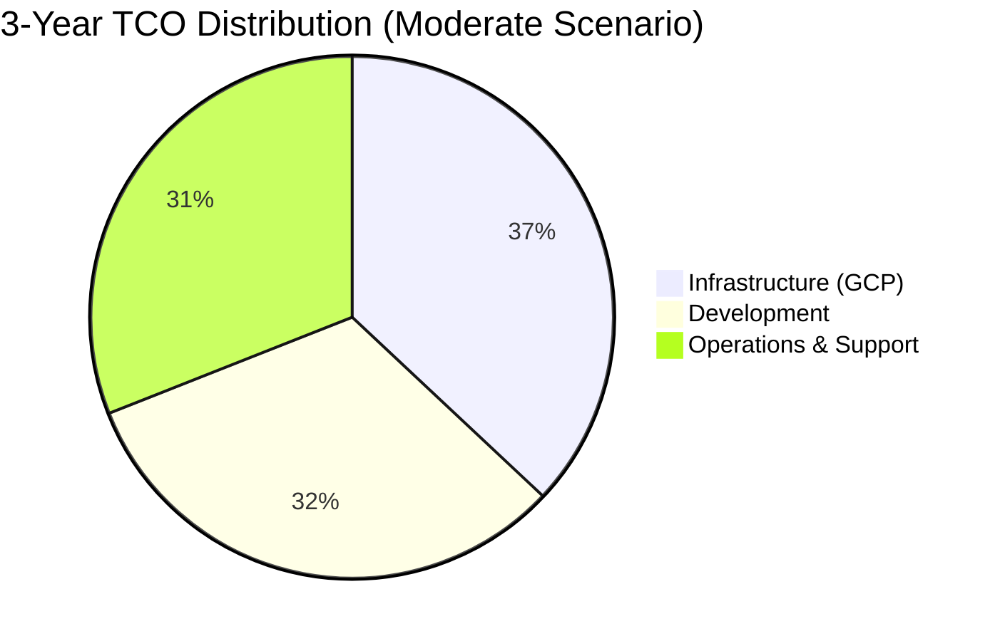
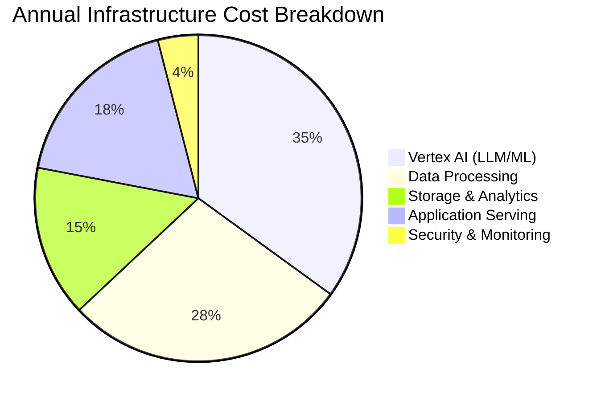

# AI-Enhanced Customer Complaints Platform

## Cost Estimate - GCP Implementation

> **Note:** These estimates are indicative and based on typical enterprise banking scale. Actual costs will vary based on specific volumes, usage patterns, and negotiated GCP enterprise agreements.

---

## Executive Summary

| Category                         | Year 1 (Build + Run)      | Year 2+ (Run)           |
| -------------------------------- | ------------------------- | ----------------------- |
| **Infrastructure (GCP)**         | £180,000 - £280,000       | £120,000 - £200,000     |
| **Development & Implementation** | £400,000 - £600,000       | —                       |
| **Ongoing Operations & Support** | £80,000 - £120,000        | £150,000 - £220,000     |
| **Total**                        | **£660,000 - £1,000,000** | **£270,000 - £420,000** |

---

## 1. GCP Infrastructure Costs (Monthly)

### 1.1 Vertex AI Services

| Service                                    | Usage Assumption                   | Unit Cost           | Monthly Est.        |
| ------------------------------------------ | ---------------------------------- | ------------------- | ------------------- |
| **Gemini Pro** (Classification, Sentiment) | 500K requests/month, avg 1K tokens | ~£0.00025/1K tokens | £2,000 - £4,000     |
| **Gemini Pro** (Generation, Research)      | 100K requests/month, avg 2K tokens | ~£0.00125/1K tokens | £1,500 - £3,000     |
| **Text Embeddings API**                    | 2M embeddings/month                | £0.000025/embedding | £50 - £100          |
| **Vertex AI Search**                       | RAG queries, 50K/month             | £2-4 per 1K queries | £100 - £200         |
| **Vector Search**                          | 10M vectors, queries               | Index + query costs | £500 - £1,000       |
| **Agent Builder**                          | Complex research tasks             | Per query pricing   | £300 - £600         |
| **Subtotal**                               |                                    |                     | **£4,450 - £8,900** |

### 1.2 Data Processing

| Service               | Usage Assumption   | Unit Cost             | Monthly Est.        |
| --------------------- | ------------------ | --------------------- | ------------------- |
| **Document AI** (OCR) | 50K pages/month    | £0.065/page           | £3,250              |
| **Speech-to-Text**    | 500 hours/month    | £0.024/min            | £720                |
| **Dataflow**          | Streaming + batch  | vCPU hours            | £800 - £1,500       |
| **Cloud DLP**         | PII scanning       | £0.01-3/GB            | £500 - £1,000       |
| **Pub/Sub**           | Message throughput | Per message + storage | £100 - £200         |
| **Subtotal**          |                    |                       | **£5,370 - £6,670** |

### 1.3 Data Storage & Analytics

| Service                 | Usage Assumption            | Unit Cost             | Monthly Est.        |
| ----------------------- | --------------------------- | --------------------- | ------------------- |
| **BigQuery Storage**    | 5TB active + 20TB long-term | £0.02/GB active       | £500 - £800         |
| **BigQuery Queries**    | 50TB scanned/month          | £5/TB                 | £250 - £500         |
| **Cloud Storage**       | 10TB raw data               | £0.02/GB              | £200                |
| **Firestore**           | Application data            | Document reads/writes | £200 - £400         |
| **Memorystore (Redis)** | 10GB cache                  | Instance hours        | £300 - £500         |
| **Subtotal**            |                             |                       | **£1,450 - £2,400** |

### 1.4 Application Serving

| Service                 | Usage Assumption        | Unit Cost                  | Monthly Est.        |
| ----------------------- | ----------------------- | -------------------------- | ------------------- |
| **Cloud Run**           | 4 services, autoscaling | vCPU-seconds + memory      | £800 - £1,500       |
| **Cloud Load Balancer** | Global LB               | Forwarding rules + traffic | £150 - £300         |
| **Firebase Hosting**    | Angular SPA             | Bandwidth + storage        | £50 - £100          |
| **Apigee** (optional)   | API management          | Enterprise tier            | £1,500 - £3,000     |
| **Subtotal**            |                         |                            | **£2,500 - £4,900** |

### 1.5 Security & Monitoring

| Service              | Usage Assumption      | Unit Cost                 | Monthly Est.    |
| -------------------- | --------------------- | ------------------------- | --------------- |
| **Cloud IAM**        | Identity management   | Included                  | £0              |
| **Cloud KMS**        | Key management        | Key versions + operations | £50 - £100      |
| **Cloud Audit Logs** | Compliance logging    | Storage costs             | £100 - £200     |
| **Cloud Monitoring** | Metrics, logs, traces | Ingested data volume      | £300 - £500     |
| **Data Catalog**     | Metadata management   | API calls                 | £50 - £100      |
| **Subtotal**         |                       |                           | **£500 - £900** |

### 1.6 Monthly Infrastructure Total

| Scenario         | Monthly Cost | Annual Cost |
| ---------------- | ------------ | ----------- |
| **Conservative** | £14,270      | £171,240    |
| **Moderate**     | £19,500      | £234,000    |
| **High Usage**   | £23,770      | £285,240    |

> **Note:** Sustained use discounts (up to 30%) and committed use discounts (up to 57%) can significantly reduce these costs.

---

## 2. Development & Implementation Costs

### 2.1 Team Composition

| Role                           | Count | Duration | Day Rate | Total          |
| ------------------------------ | ----- | -------- | -------- | -------------- |
| **Technical Architect**        | 1     | 6 months | £850     | £110,500       |
| **ML/AI Engineer**             | 2     | 8 months | £750     | £260,000       |
| **Backend Developer**          | 2     | 8 months | £650     | £226,000       |
| **Angular Frontend Developer** | 2     | 6 months | £600     | £156,000       |
| **Data Engineer**              | 1     | 6 months | £700     | £91,000        |
| **DevOps/Platform Engineer**   | 1     | 6 months | £700     | £91,000        |
| **QA Engineer**                | 1     | 4 months | £550     | £48,000        |
| **Project Manager**            | 1     | 9 months | £650     | £126,750       |
| **Subtotal**                   |       |          |          | **£1,109,250** |

### 2.2 Phased Delivery (Recommended)

| Phase                         | Duration      | Focus                                              | Est. Cost               |
| ----------------------------- | ------------- | -------------------------------------------------- | ----------------------- |
| **Phase 1: Foundation**       | 3 months      | Infrastructure, ingestion, basic classification    | £180,000 - £250,000     |
| **Phase 2: Core RAG**         | 2 months      | Vector search, NL query, sentiment analysis        | £120,000 - £180,000     |
| **Phase 3: Analytics**        | 2 months      | Dashboards, D3.js visualizations, journey tracking | £100,000 - £150,000     |
| **Phase 4: Agentic Research** | 2 months      | Agent Builder integration, deep research           | £80,000 - £120,000      |
| **Phase 5: Hardening**        | 1 month       | Security, testing, documentation, training         | £50,000 - £80,000       |
| **Total**                     | **10 months** |                                                    | **£530,000 - £780,000** |

### 2.3 Build vs. Buy Considerations

| Approach                  | Pros                             | Cons                         | Cost Impact |
| ------------------------- | -------------------------------- | ---------------------------- | ----------- |
| **Full Custom Build**     | Full control, tailored features  | Longer timeline, higher cost | +20-30%     |
| **Accelerators + Custom** | Faster delivery, proven patterns | Some constraints             | Baseline    |
| **Platform + Configure**  | Fastest, lowest risk             | Less flexibility             | -20-30%     |

---

## 3. Ongoing Operational Costs (Annual)

### 3.1 Support & Maintenance

| Category                  | Description                  | Annual Cost             |
| ------------------------- | ---------------------------- | ----------------------- |
| **L2/L3 Support**         | 2 FTE for BAU support        | £120,000 - £160,000     |
| **Platform Maintenance**  | Updates, patches, monitoring | £30,000 - £50,000       |
| **LLM Prompt Tuning**     | Ongoing optimization         | £20,000 - £40,000       |
| **Security Reviews**      | Quarterly assessments        | £15,000 - £25,000       |
| **Training & Enablement** | User training, documentation | £10,000 - £20,000       |
| **Subtotal**              |                              | **£195,000 - £295,000** |

### 3.2 GCP Enterprise Support

| Tier         | Coverage                  | Annual Cost       |
| ------------ | ------------------------- | ----------------- |
| **Standard** | Business hours, web/email | Included          |
| **Enhanced** | 24/7, 1hr response (P1)   | £12,000 - £20,000 |
| **Premium**  | TAM, proactive reviews    | £40,000 - £60,000 |

---

## 4. Total Cost of Ownership (3-Year View)

### 4.1 Conservative Scenario

| Year             | Infrastructure | Development | Operations | Total          |
| ---------------- | -------------- | ----------- | ---------- | -------------- |
| **Year 1**       | £170,000       | £530,000    | £100,000   | £800,000       |
| **Year 2**       | £180,000       | —           | £195,000   | £375,000       |
| **Year 3**       | £190,000       | —           | £200,000   | £390,000       |
| **3-Year Total** |                |             |            | **£1,565,000** |

### 4.2 Moderate Scenario

| Year             | Infrastructure | Development | Operations | Total          |
| ---------------- | -------------- | ----------- | ---------- | -------------- |
| **Year 1**       | £235,000       | £650,000    | £120,000   | £1,005,000     |
| **Year 2**       | £250,000       | —           | £245,000   | £495,000       |
| **Year 3**       | £270,000       | —           | £260,000   | £530,000       |
| **3-Year Total** |                |             |            | **£2,030,000** |

### 4.3 High Usage Scenario

| Year             | Infrastructure | Development | Operations | Total          |
| ---------------- | -------------- | ----------- | ---------- | -------------- |
| **Year 1**       | £285,000       | £780,000    | £150,000   | £1,215,000     |
| **Year 2**       | £320,000       | —           | £295,000   | £615,000       |
| **Year 3**       | £360,000       | —           | £320,000   | £680,000       |
| **3-Year Total** |                |             |            | **£2,510,000** |

---

## 5. Cost Optimization Strategies

### 5.1 GCP Discounts

| Strategy                    | Potential Savings          |
| --------------------------- | -------------------------- |
| **Committed Use Discounts** | 30-57% on compute/memory   |
| **Sustained Use Discounts** | Up to 30% automatic        |
| **BigQuery Flat-Rate**      | Predictable costs at scale |
| **Enterprise Agreement**    | Volume discounts + credits |

### 5.2 Architecture Optimizations

| Strategy                       | Impact                                           |
| ------------------------------ | ------------------------------------------------ |
| **Tiered LLM Usage**           | Use smaller models for simple tasks              |
| **Caching (Memorystore)**      | Reduce repeated LLM calls by 40-60%              |
| **Batch Processing**           | Off-peak Dataflow jobs at lower cost             |
| **Vector Search Optimization** | Prune old embeddings, use appropriate dimensions |
| **Cold Storage Tiering**       | Move old data to Archive storage                 |

### 5.3 Estimated Savings with Optimization

| Optimization                | Annual Savings              |
| --------------------------- | --------------------------- |
| Committed Use (1-year)      | £25,000 - £50,000           |
| LLM Caching                 | £15,000 - £30,000           |
| Storage Tiering             | £5,000 - £10,000            |
| Right-sizing                | £10,000 - £20,000           |
| **Total Potential Savings** | **£55,000 - £110,000/year** |

---

## 6. ROI Considerations

### 6.1 Quantifiable Benefits

| Benefit                           | Estimated Value                             |
| --------------------------------- | ------------------------------------------- |
| **Manual Classification Savings** | 4 FTE × £45,000 = £180,000/year             |
| **Faster Insight Generation**     | 50% reduction in analysis time              |
| **Reduced Regulatory Fines**      | Early breach detection (risk mitigation)    |
| **Customer Retention**            | 1% improvement = significant revenue impact |
| **Operational Efficiency**        | 30-40% faster complaint resolution          |

### 6.2 Payback Period

| Scenario          | Investment | Annual Benefit | Payback    |
| ----------------- | ---------- | -------------- | ---------- |
| Conservative      | £800,000   | £250,000       | ~3.2 years |
| Moderate          | £1,000,000 | £350,000       | ~2.9 years |
| With Optimization | £850,000   | £400,000       | ~2.1 years |

---

## 7. Cost Summary Visualization

---

## 8. Key Assumptions

| Assumption               | Value                      |
| ------------------------ | -------------------------- |
| Complaint volume         | 50,000 - 100,000 per month |
| Average complaint length | 500-1,000 words            |
| Call transcription hours | 500 hours/month            |
| Concurrent users         | 50-100                     |
| Data retention           | 7 years                    |
| Availability target      | 99.5%                      |
| Currency                 | GBP (£)                    |
| GCP Region               | europe-west2 (London)      |

---

## 9. Next Steps

1. **Discovery Workshop** - Refine volume assumptions and requirements
2. **GCP Assessment** - Review existing GCP footprint and enterprise agreements
3. **PoC Proposal** - 6-8 week proof of concept to validate approach and refine costs
4. **Commercial Negotiation** - Engage GCP for enterprise pricing

---

_Estimates prepared: December 2024_  
_Valid for: 90 days_  
_Subject to: Detailed discovery and GCP pricing confirmation_
