# AI Complaints Intelligence Platform

## Executive Overview Diagram

> **For PowerPoint:** Copy the Mermaid diagrams below into a Mermaid live editor (mermaid.live) and export as SVG/PNG for your slides.

---

## Option 1: Simple Three-Zone View

```mermaid
flowchart LR
    subgraph Sources["📥 DATA SOURCES"]
        direction TB
        S1[📧 Emails]
        S2[📄 Letters]
        S3[📞 Calls]
        S4[📱 Social Media]
    end

    subgraph OnPrem["🏢 YOUR INFRASTRUCTURE"]
        direction TB
        I[Secure Data<br/>Processing & Storage]
        D[(Customer Data<br/>Stays On-Prem)]
        A[Analytics &<br/>Dashboards]
    end

    subgraph Cloud["☁️ CLOUD AI"]
        direction TB
        AI[🤖 AI Services<br/>Classification • Sentiment<br/>Understanding • Research]
    end

    subgraph Users["👤 USERS"]
        direction TB
        U1[📊 Analysts]
        U2[📈 Managers]
        U3[✅ Compliance]
    end

    Sources --> OnPrem
    OnPrem <-->|PII-Masked<br/>Data Only| Cloud
    OnPrem --> Users

    style Sources fill:#e3f2fd,stroke:#1976d2
    style OnPrem fill:#e8f5e9,stroke:#388e3c
    style Cloud fill:#fff3e0,stroke:#f57c00
    style Users fill:#f3e5f5,stroke:#7b1fa2
```

---

## Option 2: Layered Platform View

```mermaid
flowchart TB
    subgraph Top["👤 INSIGHT DELIVERY"]
        direction LR
        DASH[📊 Dashboards]
        SEARCH[🔍 Natural Language Search]
        REPORTS[📄 AI Research Reports]
    end

    subgraph Middle["🤖 AI INTELLIGENCE"]
        direction LR
        CLASS[Classification]
        SENT[Sentiment Analysis]
        RAG[Smart Search]
        AGENT[Deep Research]
    end

    subgraph Bottom["📥 DATA FOUNDATION"]
        direction LR
        INGEST[Ingestion]
        PROCESS[Processing]
        STORE[Secure Storage]
    end

    subgraph Sources["Data Sources"]
        direction LR
        EMAIL[Email]
        CALLS[Calls]
        DOCS[Documents]
        SOCIAL[Social]
    end

    Sources --> Bottom
    Bottom --> Middle
    Middle --> Top

    style Top fill:#e8f5e9,stroke:#388e3c,stroke-width:2px
    style Middle fill:#fff3e0,stroke:#f57c00,stroke-width:2px
    style Bottom fill:#e3f2fd,stroke:#1976d2,stroke-width:2px
    style Sources fill:#fafafa,stroke:#9e9e9e
```

---

## Option 3: Hybrid Split View (Recommended for Proposal)

```mermaid
flowchart TB
    subgraph Input["📥 CUSTOMER FEEDBACK"]
        direction LR
        I1["📧 Emails"]
        I2["📄 Letters"]
        I3["📞 Calls"]
        I4["📱 Social"]
    end

    subgraph Platform["AI COMPLAINTS INTELLIGENCE PLATFORM"]
        direction LR

        subgraph Left["🏢 ON-PREMISES<br/>Your Control"]
            direction TB
            L1["🔒 Secure Ingestion"]
            L2["🛡️ PII Protection"]
            L3["💾 Data Storage"]
            L4["📊 Dashboards"]
        end

        subgraph Right["☁️ CLOUD AI<br/>Google Vertex AI"]
            direction TB
            R1["🧠 Understanding"]
            R2["🏷️ Classification"]
            R3["💭 Sentiment"]
            R4["🔬 Research"]
        end

        Left <-->|"Masked Data"| Right
    end

    subgraph Output["📈 BUSINESS VALUE"]
        direction LR
        O1["⚡ Faster Insights"]
        O2["✅ Consistent Classification"]
        O3["📉 Early Warning"]
        O4["🎯 Better Decisions"]
    end

    Input --> Platform
    Platform --> Output

    style Input fill:#e3f2fd,stroke:#1976d2,stroke-width:2px
    style Left fill:#e8f5e9,stroke:#388e3c,stroke-width:2px
    style Right fill:#fff3e0,stroke:#f57c00,stroke-width:2px
    style Output fill:#f3e5f5,stroke:#7b1fa2,stroke-width:2px
```

---

## Option 4: Capability Wheel

---

## Option 5: Before & After

```mermaid
flowchart LR
    subgraph Before["❌ TODAY"]
        direction TB
        B1["Manual Classification"]
        B2["Slow Insights"]
        B3["Inconsistent Tagging"]
        B4["Hidden Trends"]
        B5["Reactive Only"]
    end

    subgraph Arrow[" "]
        TRANSFORM["🚀"]
    end

    subgraph After["✅ WITH AI PLATFORM"]
        direction TB
        A1["Automated Classification"]
        A2["Instant Insights"]
        A3["Consistent & Accurate"]
        A4["Proactive Alerts"]
        A5["Deep Research"]
    end

    Before --> Arrow --> After

    style Before fill:#ffebee,stroke:#c62828,stroke-width:2px
    style After fill:#e8f5e9,stroke:#2e7d32,stroke-width:2px
    style Arrow fill:#ffffff,stroke:#ffffff
```

---

## Option 6: Data Flow (Simple)

```mermaid
flowchart LR
    A["📥<br/>Customer<br/>Feedback"]
    --> B["🔒<br/>Secure<br/>Processing"]
    --> C["🤖<br/>AI<br/>Analysis"]
    --> D["💡<br/>Insights &<br/>Actions"]

    style A fill:#e3f2fd,stroke:#1976d2,stroke-width:3px
    style B fill:#e8f5e9,stroke:#388e3c,stroke-width:3px
    style C fill:#fff3e0,stroke:#f57c00,stroke-width:3px
    style D fill:#f3e5f5,stroke:#7b1fa2,stroke-width:3px
```

---

## How to Use in PowerPoint

1. **Go to** [mermaid.live](https://mermaid.live)
2. **Paste** any diagram code above
3. **Click** "Actions" → "Download SVG" or "Download PNG"
4. **Insert** the image into your PowerPoint slide
5. **Tip:** Use SVG for best quality when resizing

### Recommended Slides:

| Slide             | Use Diagram             |
| ----------------- | ----------------------- |
| Platform Overview | Option 3 (Hybrid Split) |
| How It Works      | Option 6 (Data Flow)    |
| Capabilities      | Option 4 (Wheel)        |
| Why Change        | Option 5 (Before/After) |
| Architecture      | Option 1 (Three-Zone)   |

---

## Colour Palette Used

| Colour    | Meaning              | Hex     |
| --------- | -------------------- | ------- |
| 🔵 Blue   | Data / Input         | #e3f2fd |
| 🟢 Green  | On-Premises / Secure | #e8f5e9 |
| 🟠 Orange | Cloud AI             | #fff3e0 |
| 🟣 Purple | Users / Outcomes     | #f3e5f5 |
