# AI Complaints Intelligence Platform

## PowerPoint Proposal Content

> **Usage:** Copy the text and diagrams into your PowerPoint slides. Diagrams can be exported from [mermaid.live](https://mermaid.live) as SVG/PNG.

---

# SLIDE 1: Title Slide

**AI-Enhanced Customer Complaints Research & Insight Platform**

*Transforming how we understand, analyse, and act on customer feedback*

[Your Bank Logo]

[Date]

---

# SLIDE 2: The Challenge

## Current State Pain Points

| Challenge | Impact |
|-----------|--------|
| **Manual Classification** | Labour-intensive, inconsistent tagging across agents |
| **Slow Insights** | Weeks to identify emerging trends |
| **Limited Visibility** | Hard to track customer sentiment across journeys |
| **Reactive Approach** | Issues discovered after they escalate |
| **Siloed Data** | Difficult to correlate complaints with external events |

### Key Statistics (Customise with your data)

- **X,000** complaints processed manually per month
- **X hours** average time to categorise and route
- **X%** inconsistency rate between agents
- **£X million** potential exposure from missed early warnings

---

# SLIDE 3: The Solution

## AI-Powered Complaints Intelligence

**One platform that automatically understands, classifies, and surfaces insights from every customer interaction.**

### Core Capabilities

| Capability | What It Does |
|------------|--------------|
| 🏷️ **Auto-Classification** | Instantly categorises by product, issue type, regulatory flags |
| 💭 **Sentiment Tracking** | Monitors customer emotion across the complaint journey |
| 🔍 **Natural Language Search** | Ask questions in plain English, get instant answers |
| 📊 **Trend Detection** | Surfaces emerging issues before they escalate |
| 🔬 **AI Research** | Deep investigation with referenced, auditable reports |
| 📱 **External Monitoring** | Correlates with social media and news sentiment |

---

# SLIDE 4: How It Works

## Platform Architecture

```mermaid
flowchart LR
    A["📥<br/>Customer<br/>Feedback"] 
    --> B["🔒<br/>Secure<br/>Processing"]
    --> C["🤖<br/>AI<br/>Analysis"]
    --> D["💡<br/>Insights &<br/>Actions"]

    style A fill:#e3f2fd,stroke:#1976d2,stroke-width:3px
    style B fill:#e8f5e9,stroke:#388e3c,stroke-width:3px
    style C fill:#fff3e0,stroke:#f57c00,stroke-width:3px
    style D fill:#f3e5f5,stroke:#7b1fa2,stroke-width:3px
```



### The Journey

1. **Ingest** — Emails, letters, calls, social media flow into the platform
2. **Protect** — PII is masked; data stays securely on-premises
3. **Analyse** — Cloud AI classifies, extracts sentiment, understands context
4. **Deliver** — Dashboards, alerts, and research tools for your teams

---

# SLIDE 5: Hybrid Architecture

## Best of Both Worlds

```mermaid
flowchart TB
    subgraph Left["🏢 ON-PREMISES<br/>Your Control"]
        direction TB
        L1["🔒 Secure Ingestion"]
        L2["🛡️ PII Protection"]
        L3["💾 Data Storage"]
        L4["📊 Dashboards"]
    end

    subgraph Right["☁️ CLOUD AI<br/>Google Vertex AI"]
        direction TB
        R1["🧠 Understanding"]
        R2["🏷️ Classification"]
        R3["💭 Sentiment"]
        R4["🔬 Research"]
    end

    Left <-->|"Masked Data Only"| Right

    style Left fill:#e8f5e9,stroke:#388e3c,stroke-width:2px
    style Right fill:#fff3e0,stroke:#f57c00,stroke-width:2px
```



| On-Premises | Cloud AI |
|-------------|----------|
| ✅ Customer data stays in your control | ✅ Latest AI models (Gemini Pro) |
| ✅ Full regulatory compliance | ✅ No GPU infrastructure to manage |
| ✅ Integrates with existing systems | ✅ Pay only for what you use |
| ✅ Complete audit trail | ✅ Continuous model improvements |

**Key Security Feature:** Only anonymised, PII-masked text is sent to cloud AI services.

---

# SLIDE 6: Key Features Deep Dive

## 1. Automated Classification

**Before:** Manual tagging takes hours, inconsistent between agents

**After:** Every complaint automatically tagged in seconds

| Classification | Example Tags |
|----------------|--------------|
| **Regulatory** | FCA DISP category, potential breach flags |
| **Product** | Credit Card, Mortgage, Current Account |
| **Issue Type** | Fraud, Service Delay, Incorrect Charge |
| **Severity** | Critical, High, Medium, Low |
| **Root Cause** | System Outage, Process Failure, Human Error |

**Accuracy Target:** 95%+ consistency (vs. ~70% manual)

---

## 2. Sentiment Journey Tracking

**See how customer emotion changes across the complaint lifecycle**

```
😠 ────────────────────────────────────────────> 😊
   │                                              │
   Initial          Agent           Resolution
   Complaint      Interaction        Outcome

   [Track where interventions help — and where they don't]
```

### Use Cases
- Identify which teams/agents improve sentiment most
- Spot systemic friction points
- Measure impact of process changes
- Flag cases where sentiment never recovers

---

## 3. Natural Language Search

**Ask questions in plain English:**

> *"Show me all mortgage complaints about interest rate miscalculations in the last 3 months"*

> *"Which products saw the biggest sentiment decline after the October outage?"*

> *"Find cases where customers mentioned switching to a competitor"*

**The platform:**
- Searches across all complaint data
- Returns relevant cases with highlights
- Summarises patterns and trends
- Cites sources for every insight

---

## 4. AI Deep Research

**Complex investigations, automated**

> *"Investigate the drivers behind negative sentiment for the new mobile app update"*

**The AI agent will:**
1. Break down the question into sub-queries
2. Search internal complaints and external sources
3. Perform statistical analysis
4. Generate a referenced report with:
   - Executive summary
   - Root cause analysis
   - Supporting evidence
   - Recommended actions

**Time saved:** Days → Minutes

---

# SLIDE 7: User Experience

## Modern, Intuitive Interface

### Dashboard View
- Real-time KPIs and sentiment trends
- Interactive charts (D3.js visualisations)
- Drill-down by product, channel, time period
- Alert notifications for emerging issues

### Search & Research
- Natural language query bar
- Faceted filters for refinement
- Case detail view with full context
- Export to PDF/Excel

### Technology
- **Angular 17+** — Modern, responsive web application
- **Angular Material** — Clean, accessible UI components
- **D3.js** — Rich, interactive data visualisations

---

# SLIDE 8: Business Value

## Quantified Benefits

| Benefit | Estimated Impact |
|---------|------------------|
| **Classification Efficiency** | 80% reduction in manual tagging effort |
| **Insight Speed** | From weeks to hours for trend identification |
| **Consistency** | 95%+ classification accuracy vs 70% manual |
| **Early Warning** | Detect issues 2-4 weeks earlier |
| **Compliance** | Standardised regulatory categorisation |
| **Customer Experience** | Faster resolution, better interventions |

### Potential Savings

| Area | Annual Value |
|------|--------------|
| Reduced manual classification (4 FTE equivalent) | £180,000 |
| Faster issue resolution (operational efficiency) | £100,000 |
| Avoided regulatory penalties (risk reduction) | £250,000+ |
| Customer retention improvement (1% uplift) | Significant |

---

# SLIDE 9: Investment Overview

## Cost Summary — Hybrid Approach

### Year 1: Build & Deploy

| Category | Investment |
|----------|------------|
| Development & Implementation | £400,000 - £550,000 |
| Infrastructure (On-Prem Hardware) | £120,000 - £180,000 |
| Cloud AI Services | £60,000 - £100,000 |
| Data Centre & Hosting | £30,000 - £50,000 |
| **Total Year 1** | **£610,000 - £880,000** |

### Year 2+: Operate & Enhance

| Category | Annual Cost |
|----------|-------------|
| Cloud AI API Usage | £80,000 - £140,000 |
| Operations & Support (1.5 FTE) | £90,000 - £130,000 |
| Infrastructure & Maintenance | £50,000 - £85,000 |
| **Total Annual** | **£220,000 - £355,000** |

---

# SLIDE 10: Cost Comparison

## Implementation Options

```mermaid
xychart-beta
    title "3-Year Total Cost of Ownership (£K)"
    x-axis ["Full Cloud (GCP)", "Hybrid (Recommended)", "Full On-Prem"]
    y-axis "Cost (£000s)" 0 --> 2500
    bar [2030, 1330, 1450]
```



| Option | 3-Year TCO | Pros | Cons |
|--------|------------|------|------|
| **Full Cloud** | £2.0M | Fastest, fully managed | Highest cost, less control |
| **Hybrid** ⭐ | £1.3M | Best balance, data control | Some complexity |
| **Full On-Prem** | £1.5M | Complete control | GPU investment, slower |

**Recommendation:** Hybrid approach offers 35% cost saving with strong capability.

---

# SLIDE 11: 3-Year Investment & Return

## Financial Summary

| Year | Investment | Cumulative | Benefits | Net Position |
|------|------------|------------|----------|--------------|
| **Year 1** | £750,000 | £750,000 | £150,000 | -£600,000 |
| **Year 2** | £290,000 | £1,040,000 | £400,000 | -£640,000 |
| **Year 3** | £300,000 | £1,340,000 | £450,000 | -£490,000 |
| **Year 4** | £310,000 | £1,650,000 | £500,000 | -£300,000 |
| **Year 5** | £320,000 | £1,970,000 | £550,000 | -£70,000 |

**Payback Period:** ~2.5 - 3 years

### Intangible Benefits (Not Quantified Above)
- Improved customer experience and NPS
- Enhanced regulatory standing
- Competitive intelligence
- Organisational learning and capability

---

# SLIDE 12: Implementation Timeline

## Phased Delivery


| Phase | Duration | Deliverables |
|-------|----------|--------------|
| **1. Foundation** | 3 months | Infrastructure, ingestion pipeline, basic classification |
| **2. Core AI** | 2 months | Vector search, natural language queries, sentiment |
| **3. Analytics** | 2 months | Dashboards, D3.js visualisations, journey tracking |
| **4. Research** | 2 months | Agentic deep research, automated reports |
| **5. Go-Live** | 1 month | Security hardening, testing, training, launch |

**Total Duration:** 10 months to full capability

---

# SLIDE 13: Risk & Mitigation

## Key Risks Addressed

| Risk | Mitigation |
|------|------------|
| **Data Security** | PII masked before cloud; data stays on-prem |
| **Regulatory Compliance** | Audit trails, explainable AI, version-controlled prompts |
| **AI Accuracy** | Human-in-the-loop review, continuous benchmarking |
| **Vendor Lock-in** | Open-source on-prem stack, abstracted AI layer |
| **Change Management** | Phased rollout, training programme, champion network |
| **Integration Complexity** | Standard APIs, proven connectors, experienced team |

---

# SLIDE 14: Why Now?

## Market & Technology Drivers

| Driver | Implication |
|--------|-------------|
| **AI Maturity** | LLMs now production-ready for enterprise use |
| **Regulatory Pressure** | FCA focus on complaint handling and Consumer Duty |
| **Customer Expectations** | Demand for faster, more personalised resolution |
| **Competitive Landscape** | Peers investing in AI-driven CX capabilities |
| **Cost Pressure** | Need to do more with less, automate where possible |

**The technology is ready. The business case is clear. The time is now.**

---

# SLIDE 15: Success Criteria

## How We'll Measure Success

| Metric | Baseline | Target (Year 1) |
|--------|----------|-----------------|
| Classification accuracy | 70% | 95%+ |
| Time to classify | 15 mins | < 1 second |
| Trend detection lead time | 4 weeks | 1 week |
| Analyst productivity | Baseline | +40% |
| User satisfaction (NPS) | TBD | 50+ |

### Go-Live Criteria
- [ ] 95% classification accuracy on test dataset
- [ ] Sub-second query response times
- [ ] Security penetration test passed
- [ ] User acceptance testing complete
- [ ] Training delivered to all users

---

# SLIDE 16: Team & Governance

## Delivery Team

| Role | Responsibility |
|------|----------------|
| **Executive Sponsor** | Strategic direction, funding approval |
| **Product Owner** | Requirements, prioritisation, acceptance |
| **Technical Architect** | Solution design, integration |
| **Delivery Manager** | Timeline, resources, risks |
| **Data Protection Officer** | Privacy, compliance oversight |

## Governance

- **Steering Committee:** Monthly, executive-level
- **Working Group:** Weekly, delivery team
- **Architecture Review:** Bi-weekly, technical decisions
- **Risk Review:** Monthly, risk and compliance

---

# SLIDE 17: Next Steps

## Proposed Path Forward

| Step | Timeline | Owner |
|------|----------|-------|
| **1. Approval to proceed** | This week | Steering Committee |
| **2. Discovery workshop** | Weeks 1-2 | Business + Tech |
| **3. Data assessment** | Weeks 2-3 | Data Team |
| **4. Detailed design** | Weeks 3-6 | Architecture |
| **5. Procurement** | Weeks 4-8 | Procurement |
| **6. Phase 1 kickoff** | Week 8 | Delivery Team |

### Immediate Ask

- ✅ Approval for discovery phase (£30,000)
- ✅ Assign Product Owner and key stakeholders
- ✅ Confirm data access and security requirements

---

# SLIDE 18: Appendix — Technology Stack

## Hybrid Architecture Components

| Layer | Technology | Purpose |
|-------|------------|---------|
| **Frontend** | Angular 17+, Material, D3.js | User interface |
| **Backend** | FastAPI, LangChain | API services, RAG |
| **AI Services** | Google Gemini Pro, Vertex AI | LLM, embeddings, OCR |
| **Data** | PostgreSQL, pgvector, Elasticsearch | Storage, search |
| **Processing** | Apache Kafka, Spark, Airflow | Ingestion, ETL |
| **Security** | Keycloak, Presidio, Vault | Auth, PII, secrets |
| **Infrastructure** | Kubernetes, Docker | Container orchestration |

---

# SLIDE 19: Appendix — Glossary

| Term | Definition |
|------|------------|
| **LLM** | Large Language Model — AI that understands and generates text |
| **RAG** | Retrieval-Augmented Generation — AI that searches data before answering |
| **PII** | Personally Identifiable Information — data that identifies individuals |
| **Sentiment** | The emotional tone of text (positive, negative, neutral) |
| **Vector Search** | Finding similar content using mathematical representations |
| **Agentic AI** | AI that can plan and execute multi-step tasks autonomously |
| **On-Prem** | Infrastructure hosted in your own data centre |
| **Hybrid** | Combination of on-premises and cloud services |

---

# SLIDE 20: Thank You

## Questions?

**AI-Enhanced Customer Complaints Research & Insight Platform**

*Transforming customer feedback into actionable intelligence*

---

[Contact Details]

[Your Bank Logo]
