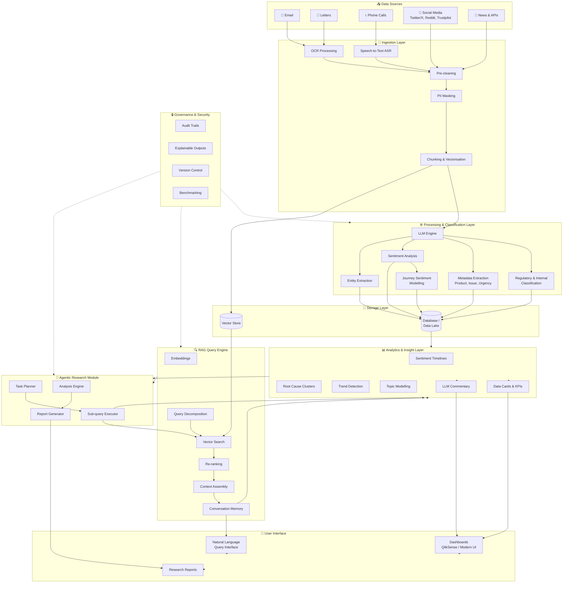
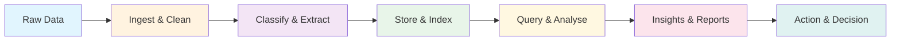

# AI-Enhanced Customer Complaints Research & Insight Platform

## High-Level System Architecture

## Component Summary

| Layer                | Components                                                  | Purpose                                               |
| -------------------- | ----------------------------------------------------------- | ----------------------------------------------------- |
| **Data Sources**     | Email, Letters, Calls, Social Media, News                   | Multi-channel complaint and context ingestion         |
| **Ingestion**        | OCR, ASR, Pre-cleaning, PII Masking, Chunking               | Transform raw data into processable, compliant format |
| **Processing**       | LLM, Classification, Metadata, Sentiment, Entity Extraction | AI-powered understanding and categorisation           |
| **Storage**          | Vector Store, Database/Data Lake                            | Persist embeddings and structured data                |
| **RAG Engine**       | Search, Re-ranking, Context Assembly, Query Decomposition   | Natural language querying over complaint data         |
| **Analytics**        | Timelines, Clusters, Trends, Data Cards, LLM Commentary     | Generate insights and KPIs                            |
| **Agentic Research** | Task Planner, Sub-query Executor, Analysis, Reports         | Deep multi-step investigation capability              |
| **Governance**       | Audit Trails, Explainability, Versioning, Benchmarks        | Compliance, security, and quality assurance           |
| **User Interface**   | Dashboards, NL Query, Research Reports                      | Analyst and stakeholder interaction layer             |

## Data Flow Overview

