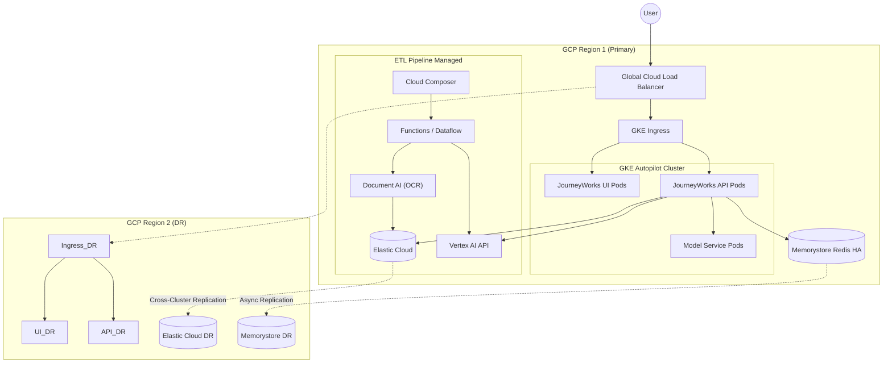
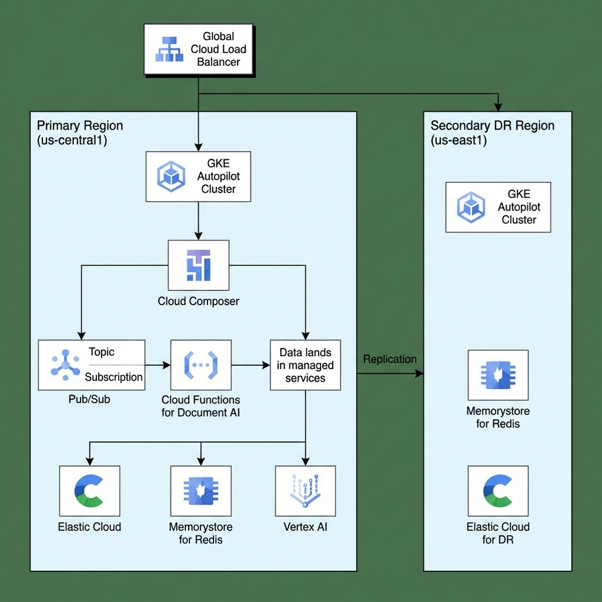

# Solution Design Document: JourneyWorks GCP Production

## 1. Executive Summary
This document outlines the solution design for deploying the "JourneyWorks" application on Google Cloud Platform (GCP). The solution utilizes cloud-native managed services for maximum scalability, reduced operational overhead, and native integration with Google's Gemini LLM capabilities.

### 1.1 Key Assumptions
| Assumption | Value | Impact |
|------------|-------|--------|
| Direct Communications Volume | 30,000 / month (~1,000/day) | Sizing baseline |
| Social Media Volume | Unknown (design for elasticity) | Autopilot scaling |
| Data Retention | 7 years | ~2.5TB storage growth/year |
| Concurrent Users | 50 analysts | Pod autoscaling |

### 1.2 Compliance & Regulatory
*   **GDPR**: Deploy in `europe-west` region for EU data residency.
*   **FCA/PRA**: Cloud Audit Logs enabled. All LLM interactions logged (7yr retention).
*   **Data Classification**: Customer communications classified as **Confidential**. CMEK encryption mandatory.

## 2. Solution Architecture

### 2.1 Logical Architecture
The application is deployed as microservices on Google Kubernetes Engine (GKE) Autopilot.

*   **Compute**: **GKE Autopilot** (Serverless K8s). Automatically manages nodes/infrastructure.
*   **ETL & Processing**:
    *   **Orchestration**: **Cloud Composer** (Managed Airflow).
    *   **Ingestion**: **Pub/Sub** (Streaming Social Data), **Cloud Functions** (API Connectors).
    *   **Digitization**: **Google Cloud Document AI** (OCR & Form Extraction).
    *   **Processing**: **Dataflow** (Apache Beam) or **GKE Batch Jobs**.
*   **Networking**: **Cloud Load Balancing** (Global External Application Load Balancer) with Cloud CDN enabled for the frontend.
*   **Data Layer**:
    *   **Elasticsearch**: **Elastic Cloud on GCP** (Managed Service) or Self-Hosted on GKE with Persistent Disk (Balanced PD).
    *   **Redis**: **Memorystore for Redis** (High Availability Cluster).
*   **AI Integration**: Native integration with **Vertex AI**.

### 2.2 Deployment Architecture (Multi-Region DR)
The User requires DR via a "separate zone", but GCP best practice for DR is a separate *region*. Zones provide HA, Regions provide DR. This design proposes a **Multi-Zone Application in Primary Region** (High Availability) and a **warm standby in a Secondary Region** (Disaster Recovery).

*   **Primary Region (e.g., us-central1)**:
    *   GKE Cluster spread across 3 separate zones (e.g., a, b, c).
    *   Memorystore (HA) replicated across zones.
*   **DR Region (e.g., us-east1)**:
    *   Scaled-down GKE cluster (Pilot Light).
    *   Data replicated asynchronously.

### 2.3 Visual Architecture Diagram

## 3. GCP Service Specifications

### 3.1 Compute (GKE Autopilot)
*   **Scale**: Autoscaling enabled.
*   **Node Pool Configuration**:
    *   **General Purpose**: (API, UI) - e2-standard classes.
    *   **Compute Optimised**: (Analysis Service) - c2-standard classes.
    *   **ML Optimised** (Optional): Model Service can utilize **T4 GPU** accelerated pods if embedding latency is critical, otherwise standard CPU.

### 3.2 Database & Storage
*   **Elasticsearch**: 
    *   3-Node High Availability configuration.
    *   Machine Type: High Memory (e.g., 32GB RAM per node).
    *   Storage: SSD Persistent Disks.
*   **Memorystore (Redis)**:
    *   Tier: Standard Tier (High Availability).
    *   Capacity: 5GB (Scale as needed).

### 3.3 ETL & Intelligence
*   **Document AI**: Uses pre-trained OCR processors for letters/documents.
*   **Cloud Composer**: Manages the DAGs for fetching social data, triggering batch analysis, and syncing DBs.
*   **Pub/Sub**: Decouples ingestion from processing (e.g., social stream buffer).

## 4. Operational Excellence & Security

### 4.1 Security Posture
*   **Network Security**:
    *   **Cloud Armor**: WAF to protect Ingress from DDoS and OWASP Top 10 exploits.
    *   **Private Service Connect**: Private connectivity to Vertex AI (no public internet).
*   **Data Security**:
    *   **Encryption**: Customer-Managed Encryption Keys (CMEK) via Cloud KMS.
    *   **IAM**: Least Privilege access using Workload Identity (K8s SA -> Google SA).

### 4.2 Observability
*   **Suite**: **Google Cloud Operations** (formerly Stackdriver).
    *   **Logging**: Cloud Logging (Centralized).
    *   **Monitoring**: Cloud Monitoring (Metrics & Alerting).
    *   **Tracing**: Cloud Trace (Distributed Tracing).

### 4.3 Backup & Disaster Recovery (DR)
*   **RPO**: 1 Hour (Async Replication).
*   **RTO**: 2 Hours.
*   **Strategy**:
    *   **Etcd/Cluster**: GKE Backup and Restore.
    *   **Database**: Automated snapshots for Elastic/Redis.
    *   **CI/CD**: Cloud Build triggers for automated deployment to DR region.

### 4.4 CI/CD Pipeline
*   **Source**: GitHub/GitLab → **Build**: Cloud Build → **Artifact**: Artifact Registry → **Deploy**: Cloud Deploy (GKE).
*   **Stages**: Lint → Unit Test → Build Image → Security Scan (Artifact Analysis) → Deploy to Staging → Smoke Test → Promote to Prod.

### 4.5 Testing Strategy
*   **UAT**: Dedicated staging GKE namespace for business validation.
*   **Performance**: Cloud Load Testing or K6 (target: 100 concurrent users).
*   **Security**: SAST (SonarQube), Container Scanning (Artifact Analysis) integrated into CI.

## 5. Gemini LLM Integration

### 5.1 Native Vertex AI
Leverage the native Google Cloud backbone for sub-millisecond access to Vertex AI models.

*   **Authentication**: Workload Identity Federation. GKE Service Accounts impersonate Google Service Accounts (GSA) to access Vertex AI. **No API keys required** (increased security).
*   **Models**:
    *   **Gemini 1.5 Pro**: For complex reasoning cases.
    *   **Gemini 1.5 Flash**: For high-volume, low-latency tasks.

## 6. Cost Estimation (Monthly)

*Estimates based on typical production usage (sustained use).*

| Service | Configuration | Est. Monthly Cost |
|---------|---------------|-------------------|
| **GKE Autopilot** | ~10 vCPU, 40GB RAM total (Autoscaled) | ~$400 |
| **Cloud Load Balancing** | 1 Forwarding Rule + Data Processing | ~$30 |
| **Memorystore (Redis)** | 5GB Standard Tier (HA) | ~$150 |
| **Elastic Cloud** | High Availability (3 Zones), 32GB RAM total | ~$400 |
| **Cloud Composer** | Small Environment (HA) | ~$350 |
| **Document AI** | Pay-per-use (approx 10k pages/mo) | ~$300 |
| **Vertex AI** | Est. 75M tokens (30k docs + Social buffer) | ~$400 |
| **Networking/Egress** | Est. 1TB Egress | ~$80 |
| **Primary Region Total** | | **~$2,110 / mo** |

### 6.1 External Licensing & Data Costs
Non-GCP costs required for data ingestion:
| License / Service | Description | Estimated Monthly Cost |
|-------------------|-------------|------------------------|
| **Social Media APIs** | Enterprise access (X/Twitter, Meta) or Aggregator (e.g., Gnip/Brandwatch) | ~$5,000 |
| **Total External** | | **~$5,000 / mo** |

### 6.2 Scalability Note: Unknown Social Volume
This architecture is uniquely positioned to handle the "unknown" quantity of social media posts without over-provisioning:
1.  **GKE Autopilot**: You only pay for the exact CPU/RAM used by the pods. If social volume is low, costs remain at baseline. If a viral event occurs, it scales up automatically to handle the ingestion spike and scales back down immediately after.
2.  **Serverless Ingestion**: Pub/Sub and Cloud Functions scale to millions of events per second with no pre-warming required.

*DR Region costs would be ~40% of Primary if running "Pilot Light" (minimal resources until failover).*

**Estimated DR Region Cost**: ~$850/mo (Pilot Light configuration).

## 7. Comparison: GCP vs On-Prem

| Feature | On-Premise | GCP |
|---------|------------|-----|
| **CapEx** | High (Hardward purchase ~$70k+) | Low ($0) |
| **OpEx** | Low (Power/Cooling/Personnel) | Medium (Monthly bill) |
| **Scalability** | Limited by physical hardware | Infinite (Autoscaling) |
| **Security** | Perimeter security, full control | IAM, Workload Identity, Cloud Armor |
| **Recovery (RTO)** | Slower (Manual Hardware/Restore) | **Fast (Automated Zone Failover)** |
| **AI Access** | Via Public Internet / VPN | **Private Google Backbone (Fastest)** |

## 8. Management Overview

### 8.1 Running Costs (OpEx) Structure
GCP operates on a pure OpEx model.
*   **Infrastructure Bill**: ~$2,100/mo base (scales with usage).
*   **External Data/APIs**: ~$5,000/mo (Social Media).
*   **Operational Savings**: No dedicated hardware staff required. Patching/maintenance managed by Google (Autopilot/Cloud SQL).
*   **Commitment Discounts**: 1-year or 3-year CUDs (Committed Use Discounts) can reduce GKE/Compute costs by 30-50%.

### 8.2 Implementation Roadmap
*   **Phase 1: Landing Zone (Weeks 1-2)**: Setup GCP Organization, VPCs, IAM, Security Command Center.
*   **Phase 2: Platform Deployment (Weeks 3-6)**: Terraform-based deployment of GKE, Cloud SQL, Vertex AI.
*   **Phase 3: Application Deployment (Weeks 7-10)**: CI/CD setup, Container deployment, Ingress config.
*   **Phase 4: Pilot & Integration (Weeks 11-14)**: Live data ingestion testing, Load testing.
*   **Phase 5: Production (Week 15+)**: Go-Live.
*   **Time-to-Value**: ~2-3 weeks faster than On-Prem due to no hardware lead time.

### 8.3 Recommended Team Composition (Agile Squad)
*   **Product Owner (PO)**: Defined feature roadmap and priorities.
*   **Business Analyst (BA)**: Requirements gathering (Letters, Regs, Compliance).
*   **Scrum Master**: Agile ceremony facilitation.
*   **1x Cloud Architect**: GCP design & security.
*   **1x Platform Engineer (DevOps)**: Terraform, GKE, CI/CD.
*   **2x Backend Engineers**: NestJS, Python services.
*   **1x Data Engineer**: Cloud Composer, Dataflow.
*   **2x Frontend Engineers**: Angular UI.
*   **1x QA/SDET**: Automated testing.

### 8.4 Team Cost Estimation (Blended Rate)
Estimated monthly costs based on a specific location strategy:
*   **Senior/Leads (Poland)**: Cloud Arch, PO, Scrum Master, Lead Devs.
*   **Mid/Core (India)**: BA, Platform Eng, Data Engineer, Core Devs.

| Role Group | Location | Count | Est. Rate/Mo | Subtotal |
|------------|----------|-------|--------------|----------|
| Senior Leadership | Poland | 5 | ~$7,500 | $37,500 |
| Core Engineering | India | 6 | ~$3,500 | $21,000 |
| **Total Team Cost** | | **11** | | **~$58,500 / mo** |

*Role Mapping: Poland = PO, SM, Arch, 2x Lead Dev. India = BA, Platform Eng, Data Eng, 2x Dev, QA.*

## 9. Key Risks & Mitigations
| Risk | Likelihood | Impact | Mitigation |
|------|------------|--------|------------|
| Cloud cost overrun (viral event) | Medium | Medium | Set budget alerts; cap autoscaling. |
| Social API pricing changes | Medium | Medium | Budget 20% contingency; evaluate aggregators. |
| Gemini rate limits / outages | Low | High | Implement circuit breaker; cache common responses. |
| Vendor lock-in | Low | Medium | Use Kubernetes; abstract cloud-specific APIs. |

## 10. Total Cost of Ownership (3-Year)
| Cost Category | Year 1 | Year 2 | Year 3 | 3-Year Total |
|---------------|--------|--------|--------|-------------|
| GCP Infra (OpEx) | $35,520 | $35,520 | $35,520 | $106,560 |
| External APIs (OpEx) | $60,000 | $60,000 | $60,000 | $180,000 |
| Team (OpEx) | $702,000 | $702,000 | $702,000 | $2,106,000 |
| **Total** | **$797,520** | **$797,520** | **$797,520** | **$2,392,560** |

> **3-Year Savings vs On-Prem**: ~$193k (primarily CapEx avoidance and reduced ops overhead).

