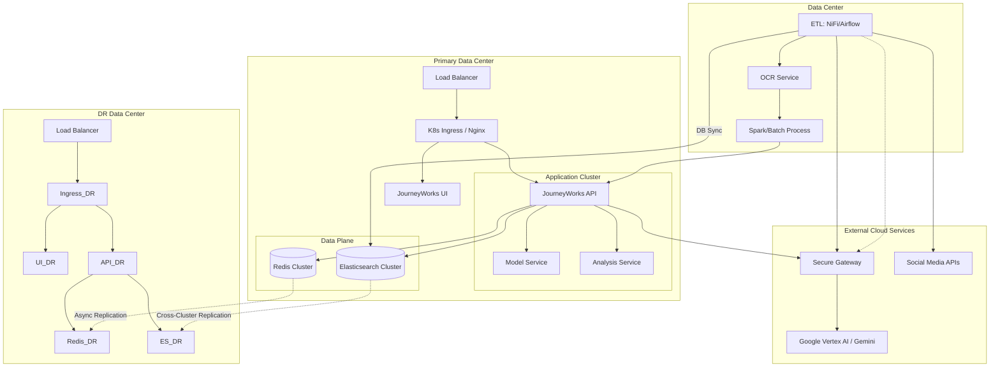

# Solution Design Document: JourneyWorks On-Premise Production

## 1. Executive Summary

This document outlines the solution design for deploying the "JourneyWorks" application in an On-Premise environment. The solution is designed for High Availability (HA) within the primary datacenter and includes a geographically separated Disaster Recovery (DR) site. It integrates with Google's Gemini LLM family for AI capabilities.

### 1.1 Key Assumptions

| Assumption                   | Value                           | Impact                     |
| ---------------------------- | ------------------------------- | -------------------------- |
| Direct Communications Volume | 30,000 / month (~1,000/day)     | Sizing baseline            |
| Social Media Volume          | Unknown (design for elasticity) | Horizontal scaling         |
| Data Retention               | 7 years                         | ~2.5TB storage growth/year |
| Concurrent Users             | 50 analysts                     | API pod scaling            |
| Primary-DR Latency           | <50ms WAN link                  | ES CCR performance         |

### 1.2 Compliance & Regulatory

- **GDPR**: Data residency within EU (if applicable). Right to erasure supported.
- **FCA/PRA**: Audit logging enabled. All LLM interactions logged for 7 years.
- **Data Classification**: Customer communications classified as **Confidential**.

## 2. Solution Architecture

### 2.1 Logical Architecture

The application follows a microservices architecture containerized using Docker, managed by Kubernetes (K8s) for orchestration in production.

- **Presentation Layer**: Angular frontend served via Nginx ingress.
- **Application Layer**: NestJS API, Python Model Service (Embeddings), Python Analysis Service.
- **ETL & Processing Layer**:
  - **Orchestration**: Apache Airflow (on K8s).
  - **Ingestion**: Apache NiFi (or custom Python Connectors) for DBs and Social APIs.
  - **Digitization**: Containerized OCR Service (e.g., Tesseract/PaddleOCR) or Hybrid Document AI.
  - **Batch Processing**: Spark on K8s or Dask for large-scale transformation & sentiment analysis.
- **Data Layer**:
  - **Elasticsearch**: Primary data store for cases, chunks, events.
  - **Redis**: Caching and session management.
- **AI Integration**: Hybrid approach connecting to Google Vertex AI (Gemini) via secure gateway.

### 2.2 Deployment Architecture (Active/Passive DR)

- **Primary Site (Active)**: Fully redundant K8s cluster, Hazmat/DMZ configuration as required by security.
- **DR Site (Passive/Warm)**: Duplicate hardware footprint. Data replicated via storage replication or application-level replication (e.g., Elasticsearch CCR).

### 2.3 Visual Architecture Diagram

## 3. Hardware Requirements & Specs

Hardware is specified for the **Primary Site**. The **DR Site** requires an identical footprint to ensure full performance during failover (RTO/RPO requirements dependent).

### 3.1 Compute (Kubernetes Cluster)

- **Control Plane Nodes (x3)**:
  - CPU: 8 Cores
  - RAM: 32 GB
  - Disk: 500GB SSD (etcd performance)
- **Worker Nodes (x5)** (+2 for ETL) - _Adjusted for ~1k comms/day base load_:
  - Hosting: API, UI, Analysis Service, Model Service, **Airflow, NiFi, Spark Executors**.
  - CPU: 16 Cores (Intel Xeon / AMD EPYC)
  - RAM: 64 GB
  - Disk: 1TB SSD
  - _Note_: **Scalability**: This baseline supports the 30k/mo direct communications comfortably. As Social Media volume becomes known, additional Worker Nodes can be added horizontally to handle the ingestion/batch processing spikes.

### 3.2 Data Layer (Dedicated Nodes Recommended)

- **Elasticsearch Nodes (x3 - Hot/Warm)**:
  - CPU: 16 Cores
  - RAM: 64 GB (32GB Heap)
  - Disk: 4TB NVMe SSD (fast indexing/search)
- **Redis (x3 - Sentinel/Cluster)**:
  - CPU: 4 Cores
  - RAM: 32 GB
  - Disk: 200GB SSD

### 3.3 Network

- 10Gbps Internal switching for storage/cluster traffic.
- Secure outbound internet access (allowlist) for connectivity to `*.googleapis.com` (Vertex AI).

## 4. Operational Excellence & Security

### 4.1 Security Posture

- **Encryption**:
  - **At Rest**: LUKS encryption for all local SSDs. Elasticsearch Native Encryption.
  - **In Transit**: mTLS between K8s services (Istio/Linkerd). TLS 1.3 for all ingress/egress.
- **IAM**:
  - **RBAC**: Strict K8s RBAC integrated with corporate LDAP/AD.
  - **Secrets**: HashiCorp Vault for managing DB credentials and API keys.

### 4.2 Observability

- **Metrics**: Prometheus (Collection) + Grafana (Visualization).
- **Logs**: Fluent Bit (Shipper) -> Elasticsearch -> Kibana.
- **Tracing**: OpenTelemetry auto-instrumentation for NestJS/Python services.

### 4.3 Backup & Disaster Recovery (DR)

- **RPO (Recovery Point Objective)**: 15 Minutes.
- **RTO (Recovery Time Objective)**: 4 Hours.
- **Strategy**:
  - **Database**: Daily Snapshots to S3-compatible on-prem storage (e.g., MinIO).
  - **Configuration**: GitOps (ArgoCD) for rapid cluster reconstruction.

### 4.4 CI/CD Pipeline

- **Source**: GitLab/GitHub → **Build**: Jenkins/GitLab CI → **Artifact**: Harbor Registry → **Deploy**: ArgoCD (GitOps).
- **Stages**: Lint → Unit Test → Build Image → Security Scan (Trivy) → Deploy to Staging → Smoke Test → Promote to Prod.

### 4.5 Testing Strategy

- **UAT**: Dedicated staging environment for business validation.
- **Performance**: K6/Locust load testing (target: 100 concurrent users).
- **Security**: SAST (SonarQube), DAST (OWASP ZAP) integrated into CI.

## 5. Gemini LLM Integration

### 5.1 Hybrid Connectivity

Since the JourneyWorks platform is on-premise, it will consume Google Gemini models (Gemini Pro / Flash) via Google Vertex AI API.

- **Authentication**: Service Account credentials with **Vertex AI User** role, securely stored in K8s Secrets or HashiCorp Vault.
- **Connectivity**:
  - **Option A (Standard)**: HTTPS traffic over public internet to Google APIs.
  - **Option B (Private)**: Cloud VPN or Interconnect to a Google Cloud VPC, using Private Service Connect for private access to Vertex AI APIs (Recommended for enterprise security).

### 5.2 Data Privacy

- "Do Not Train" policy enforced via Enterprise agreement.
- PII redaction (Data Loss Prevention) implemented in the NestJS API layer _before_ sending prompts to Gemini.

## 6. Cost Estimation (Hardware & Licensing)

_Estimates are indicative for enterprise-grade hardware (e.g., Dell/HPE)._

**Primary Site:**
| Item | Spec | Qty | Unit Cost (Est) | Total |
|------|------|-----|----------------|-------|
| Control Plane Server | 1U, 8C, 32GB | 3 | $3,000 | $9,000 |
| Worker Note Server | 1U, 16C, 64GB | 5 | $5,000 | $25,000 |
| Database Server (ES) | 2U, 16C, 64GB, NVMe| 3 | $8,000 | $24,000 |
| Redis Server | 1U, 4C, 32GB | 3 | $2,500 | $7,500 |
| Networking | Top-of-Rack Switch 10G | 2 | $4,000 | $8,000 |
| **Total Hardware (Primary)** | | | | **$73,500** |

**DR Site:**

- **Total Hardware (DR)**: **$73,500** (Full Duplication)

**Annual Software & Data Licensing (OpEx):**
| License / Service | Description | Estimated Monthly Cost |
|-------------------|-------------|------------------------|
| **Social Media APIs** | Enterprise access (X/Twitter, Meta) or Aggregator (e.g., Gnip/Brandwatch) | ~$5,000 |
| **Rancher/OpenShift** | K8s Enterprise Support | ~$1,250 |
| **Elastic Enterprise** | Optional: ML/Security features | ~$1,500 |
| **Google Vertex AI** | 75M Tokens (Gemini) | ~$400 |
| **Total Licensing** | | **~$8,150 / mo** |

### 6.1 Non-Production Environments

Two non-production environments are required: **SIT** (System Integration Testing) and **UAT** (User Acceptance Testing). UAT is specified at production-equivalent levels to ensure realistic performance validation. SIT is right-sized for functional and integration testing at reduced cost. Neither environment requires a DR site.

#### 6.1.1 SIT Environment (~50% of Production)

SIT is used for integration testing and does not require production-grade throughput or HA. Hardware is consolidated to reduce cost.

| Item                     | Spec                   | Qty | Unit Cost (Est) | Total       |
| ------------------------ | ---------------------- | --- | --------------- | ----------- |
| Control Plane Server     | 1U, 8C, 32GB           | 1   | $3,000          | $3,000      |
| Worker Node Server       | 1U, 16C, 64GB          | 2   | $5,000          | $10,000     |
| Database Server (ES)     | 1U, 16C, 32GB, SSD     | 1   | $5,500          | $5,500      |
| Redis Server             | 1U, 4C, 16GB           | 1   | $1,800          | $1,800      |
| Networking               | Top-of-Rack Switch 10G | 1   | $4,000          | $4,000      |
| **Total Hardware (SIT)** |                        |     |                 | **$24,300** |

_Note: SIT uses a single-node Elasticsearch instance and a single Redis node. No DR site is provisioned._

**SIT Annual Software & Data Licensing (OpEx):**
| License / Service | Description | Estimated Monthly Cost |
|-------------------|-------------|------------------------|
| **Social Media APIs** | Sandbox/test access (reduced tier) | ~$500 |
| **Rancher/OpenShift** | K8s Enterprise Support (included in prod licence for non-prod use) | ~$0 |
| **Elastic Enterprise** | Dev/Test licence | ~$500 |
| **Google Vertex AI** | 15M Tokens (test volume) | ~$80 |
| **Total SIT Licensing** | | **~$1,080 / mo** |

#### 6.1.2 UAT Environment (Production-Equivalent)

UAT mirrors production hardware specifications to ensure realistic validation of performance, data volumes, and LLM behaviour before go-live. No DR site is required.

| Item                     | Spec                   | Qty | Unit Cost (Est) | Total       |
| ------------------------ | ---------------------- | --- | --------------- | ----------- |
| Control Plane Server     | 1U, 8C, 32GB           | 3   | $3,000          | $9,000      |
| Worker Node Server       | 1U, 16C, 64GB          | 5   | $5,000          | $25,000     |
| Database Server (ES)     | 2U, 16C, 64GB, NVMe    | 3   | $8,000          | $24,000     |
| Redis Server             | 1U, 4C, 32GB           | 3   | $2,500          | $7,500      |
| Networking               | Top-of-Rack Switch 10G | 2   | $4,000          | $8,000      |
| **Total Hardware (UAT)** |                        |     |                 | **$73,500** |

_Note: UAT matches full production specification but does not include a DR site._

**UAT Annual Software & Data Licensing (OpEx):**
| License / Service | Description | Estimated Monthly Cost |
|-------------------|-------------|------------------------|
| **Social Media APIs** | Test access (may share production licence or use sandbox) | ~$2,000 |
| **Rancher/OpenShift** | K8s Enterprise Support (included in prod licence for non-prod use) | ~$0 |
| **Elastic Enterprise** | Production-equivalent licence | ~$1,500 |
| **Google Vertex AI** | 75M Tokens (full test corpus) | ~$400 |
| **Total UAT Licensing** | | **~$3,900 / mo** |

#### 6.1.3 Non-Production Cost Summary

| Environment                  | Hardware (CapEx) | Monthly Licensing | Annual Licensing |
| ---------------------------- | ---------------- | ----------------- | ---------------- |
| SIT (~50% Prod)              | $24,300          | ~$1,080           | ~$12,960         |
| UAT (Prod-equivalent, no DR) | $73,500          | ~$3,900           | ~$46,800         |
| **Total Non-Prod**           | **$97,800**      | **~$4,980**       | **~$59,760**     |

## 7. Management Overview

### 7.1 Running Costs (OpEx) Estimates

Beyond hardware CapEx, the following annual OpEx is estimated:

- **Data Center Power/Cooling**: ~$8,000/yr (per rack).
- **Hardware Maintenance Contracts**: ~$5,000/yr.
- **IT Operations Staff**: 0.5 FTE for ongoing hardware/network maintenance.

### 7.2 Implementation Roadmap

- **Phase 1: Foundation (Weeks 1-4)**: Hardware procurement, racking, OS/K8s installation.
- **Phase 2: Platform Build (Weeks 5-8)**: Deploy K8s services (ES, Redis, Airflow), set up security/IAM.
- **Phase 3: Application Migration (Weeks 9-12)**: Deploy JourneyWorks apps, set up CI/CD pipelines.
- **Phase 4: Pilot & Data Ingestion (Weeks 13-16)**: Connect live data feeds, run batch tests, tune LLM.
- **Phase 5: Go-Live (Week 17+)**: Production cutover and handover to ops.

### 7.3 Recommended Team Composition (Agile Squad)

- **Product Owner (PO)**: Defined feature roadmap and priorities.
- **Business Analyst (BA)**: Requirements gathering (Letters, Regs, Compliance).
- **Scrum Master**: Agile ceremony facilitation.
- **1x Solution Architect**: Technical leadership.
- **1x DevOps Engineer**: K8s, CI/CD, Infrastructure.
- **2x Backend Engineers**: NestJS, Python services, Integrations.
- **1x Data Engineer**: ETL pipelines (Airflow/NiFi), Spark.
- **2x Frontend Engineers**: Angular UI.
- **1x QA/SDET**: Automated testing.

### 7.4 Team Cost Estimation (Blended Rate)

Estimated monthly costs based on a specific location strategy:

- **Senior/Leads (Poland)**: Solution Arch, PO, Scrum Master, Lead Devs.
- **Mid/Core (India)**: BA, DevOps, Data Engineer, QA, Core Devs.

| Role Group          | Location | Count  | Est. Rate/Mo | Subtotal          |
| ------------------- | -------- | ------ | ------------ | ----------------- |
| Senior Leadership   | Poland   | 5      | ~$7,500      | $37,500           |
| Core Engineering    | India    | 6      | ~$3,500      | $21,000           |
| **Total Team Cost** |          | **11** |              | **~$58,500 / mo** |

_Role Mapping: Poland = PO, SM, Arch, 2x Lead Dev. India = BA, DevOps, Data Eng, 2x Dev, QA._

## 8. Key Risks & Mitigations

| Risk                         | Likelihood | Impact | Mitigation                                         |
| ---------------------------- | ---------- | ------ | -------------------------------------------------- |
| Hardware procurement delays  | Medium     | High   | Order 8-12 weeks ahead; consider leasing.          |
| Social API pricing changes   | Medium     | Medium | Budget 20% contingency; evaluate aggregators.      |
| Gemini rate limits / outages | Low        | High   | Implement circuit breaker; cache common responses. |
| Key person dependency        | Medium     | High   | Cross-train team; document all runbooks.           |

## 9. Total Cost of Ownership (3-Year)

| Cost Category                        | Year 1         | Year 2       | Year 3       | 3-Year Total   |
| ------------------------------------ | -------------- | ------------ | ------------ | -------------- |
| Hardware – Production + DR (CapEx)   | $147,000       | $0           | $0           | $147,000       |
| Hardware – SIT (CapEx)               | $24,300        | $0           | $0           | $24,300        |
| Hardware – UAT (CapEx)               | $73,500        | $0           | $0           | $73,500        |
| Licensing & APIs – Production (OpEx) | $97,800        | $97,800      | $97,800      | $293,400       |
| Licensing & APIs – SIT (OpEx)        | $12,960        | $12,960      | $12,960      | $38,880        |
| Licensing & APIs – UAT (OpEx)        | $46,800        | $46,800      | $46,800      | $140,400       |
| Team (OpEx)                          | $702,000       | $702,000     | $702,000     | $2,106,000     |
| DC Power/Maint (all envs)            | $19,500        | $19,500      | $19,500      | $58,500        |
| **Total**                            | **$1,123,860** | **$879,060** | **$879,060** | **$2,881,980** |

> **Non-Prod environments add ~$97.8k in CapEx (Year 1) and ~$59.8k/yr in licensing** (~$277k over 3 years) but are essential for quality assurance and risk mitigation before production releases.
